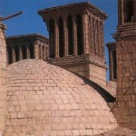
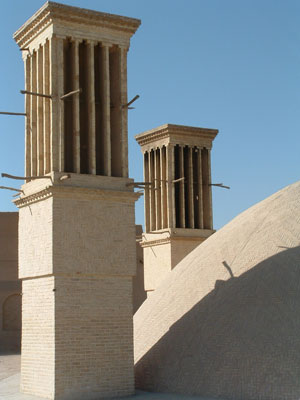

Arquitectura 
 Isl&aacutemica

 

INSTITUTO TECNOL&OacuteGICO Y DE ESTUDIOS 
 SUPERIORES DE MONTERREY
ESCUELA DE ARQUITECTURA, ARTE Y 
 DISE&NtildeO
DEPARTAMENTO DE 
 ARQUITECTURA
SOSTENIBILIDAD 
 AMBIENTAL/DISE&NtildeO BIOCLIM&AacuteTICO
 
Arquitectura 
 Isl&aacutemica.
Arq. Edmundo J. Reyes 
 Guzm&aacuten.

Nombre: _________________________.          Fecha:  ____/_____/_______.      
   Frecuencia:_____________________.
 
Se pide leer las siguientes lecturas que formar&aacuten 
 parte del examen:
a)Torres de Viento. (abrir: 
 anexo).
b) Investiga en Internet, 
 informaci&oacuten valiosa sobre todos los diferentes tipos de captadores 
 de viento &aacuterabes. Ej. Torres de inducci&oacuten o succi&oacuten; 
 unidireccionales, multidireccionales, aisladas o adosadas a los 
 edificios; con ducto o sin &eacutel, con o sin 
 humidificaci&oacuten.
 "The Bagdirs: Wind 
 catchers"....

 

 

  Bagdirs of Yadz

                                              
 Hyderabad, Sindh; Pakist&aacuten.  
 

 

 

 
Put Document Title Here

.counter {
 BACKGROUND-COLOR: black; COLOR: yellow; FONT-WEIGHT: bold
}

You have visited this page

page_counter(jcount);

 times. 

// <![CDATA[ <-- For SVG support
if ('WebSocket' in window) {
(function() {
function refreshCSS() {
var sheets = [].slice.call(document.getElementsByTagName("link"));
var head = document.getElementsByTagName("head")[0];
for (var i = 0; i < sheets.length; ++i) {
var elem = sheets[i];
head.removeChild(elem);
var rel = elem.rel;
if (elem.href && typeof rel != "string" || rel.length == 0 || rel.toLowerCase() == "stylesheet") {
var url = elem.href.replace(/(&|\?)_cacheOverride=\d+/, '');
elem.href = url + (url.indexOf('?') >= 0 ? '&' : '?') + '_cacheOverride=' + (new Date().valueOf());
}
head.appendChild(elem);
}
}
var protocol = window.location.protocol === 'http:' ? 'ws://' : 'wss://';
var address = protocol + window.location.host + window.location.pathname + '/ws';
var socket = new WebSocket(address);
socket.onmessage = function(msg) {
if (msg.data == 'reload') window.location.reload();
else if (msg.data == 'refreshcss') refreshCSS();
};
console.log('Live reload enabled.');
})();
}
// ]]>

