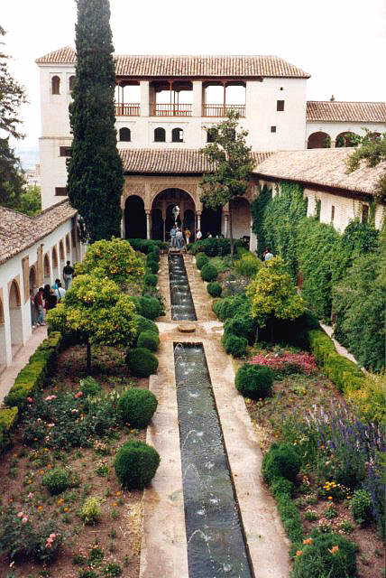
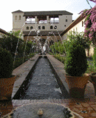

Arquitectura en 
 Granada 

 

INSTITUTO TECNOLÓGICO Y DE ESTUDIOS SUPERIORES DE 
 MONTERREY
ESCUELA DE ARQUITECTURA, ARTE Y 
 DISEÑO
DEPARTAMENTO DE ARQUITECTURA
SOSTENIBILIDAD AMBIENTAL
 
Arquitectura en Granada. 
 Generalife.
Arq. Edmundo J. Reyes 
 Guzmán.
Nombre: _________________________.          Fecha:  ____/_____/_______.        
 Frecuencia:_____________________.
Se pide: 
 
I. Una descripción general de los Jardínes de la 
 Alahambra.
II. Se pide investigar  textual, detallada y con apoyo de 
 esquemas y fotografías.. ¿Cómo funciona el Enfriamiento Pasivo Evaporativo, 
 en los jardines de la Alahambra, 
 España?...
III. Fuentes 
 Bibliografías.

 

 

 

 

    

 
        
 

 

 

Recomendaciones:
X

  En algún momento de tu vida!.. No se te olvide que tienes que 
 viajar  y conocer el mundo!... 
 ¿Deseas mandar un e-mail?...

