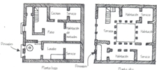
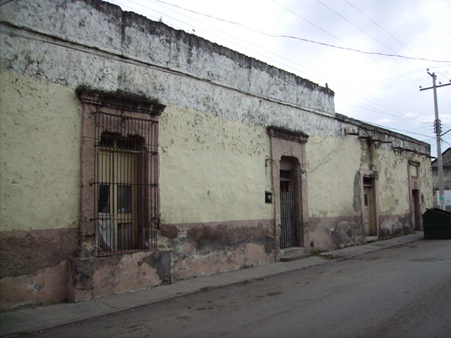
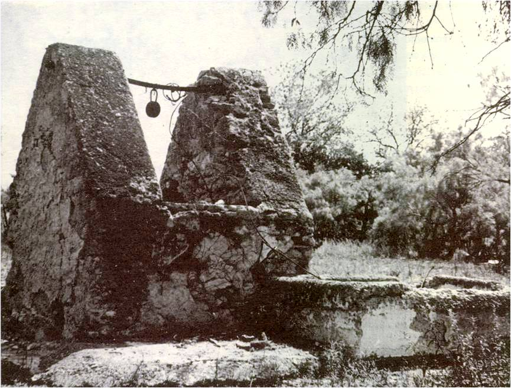

Sabia humildad.

 
 
INSTITUTO TECNOLOGICO Y DE ESTUDIOS SUPERIORES DE MONTERREY 
ESCUELA DE ARQUITECTURA, ARTE Y DISE&NtildeO 

DEPARTAMENTO DE ARQUITECTURA.

Dise&ntildeo Bioclim&aacutetico / Sostenibilidad Ambiental.
Nombre:_______________________________ 
Fecha:________________________________ 
Grupo:________________________________ 

I. SE PIDE: 
Leer atenta y detalladamente el siguiente artículo, para responder AMPLIAMIENTE y con bibliografia consultada extra, el siguiente artículo:

Antes del siglo XX, no se habían considerado las edificaciones vernáculas como valores arquitectónicos, normalmente se manejaban conceptos estilísticas, que menospreciaban estas construcciones. 
 Actualmente esto se ha discutido en el ámbito internacional, llegando a ser considerado patrimonio. Parece ser un tema de moda dentro del medio arquitectónico, pero algunas personas, no conocen a fondo el concepto. 

En la búsqueda posmoderna por encontrar manifestaciones más cercanas al ser humano, rechazando la abstracción racional, se han nombrado tendencias neovernáculas a aquellas que rescatan los valores arquitectónicos de una región. 

Frampton, en contraparte a la arquitectura internacional, plantea la correspondencia del hacer arquitectónico en relación a cada región en la que se realiza. 
Desde la 2da década de este siglo. 
Le Corbusier muestra cierto interés respecto a construcciones tradicionales y afirma que el "folclore" proporciona información importante y profunda de las necesidades humanas, pues satisface al hombre, lo hace saborear"[...] la abundancia de los bienes materiales y espirituales [...] El folclore pone en juego la intención poética, la intención de agregar materialismo en beneficio de la sensibilidad, la manifestación de un instinto creador". 
Asimismo, es conocida la influencia de la arquitectura vernácula mexicana en la obra de Luis Barragán, Roberto Littman se refiere a esta influencia definiéndola como "La sabia humildad de la tradición vernácula, que no ha olvidado la convivencia con el paisaje". 

 Por su parte, Barragán, en el discurso pronunciado al recibir el premio Pritzker, señaló que: 
 "Desde la infancia disfruté de la arquitectura popular: de las paredes blanqueadas con cal, de la alegría y el embrujo de paz de los patios y las huertas; el colorido de las casas; de los acueductos, abrevaderos y trojes. En fin, de tantos espacios logrados con tanta belleza y espontaneidad e el campo y en la provincia […]" .
En los párrafos anteriormente citados, se aprecia que tanto Le Corbusier como Barragán, manifiestan un profundo respeto por la obra vernácula, a la vez que observamos elementos que definen, describen y valoran esta arquitectura. 

La arquitectura vernácula recibe varias acepciones según el autor y la época de la definición. Generalmente se habla de diferentes términos utilizándolos como sinónimos, así se pueden encontrar expresiones arquitectónicas como : popular, de masas, primitiva, campesina, indígena o folclórica, pero conceptualmente, el término correcto es arquitectura vernácula. 
"aquella concebida como no culta, sin un estilo deliberado, y no relacionada con la arquitectura oficial". 

Bernard Rudofsky, en la publicación "Arquitectura sin Arquitectos" (1960), resultado de una exposición homónima en Nueva York, acuña el termino "vernácula" para estas edificaciones, y por primera vez realiza un estudio y descripción de estas construcciones. 

Valeria Prieto, en la publicación titular "Arquitectura popular mexicana", utiliza como sinónimos arquitectura popular y vernácula. Comentando que estas construcciones " [...] le confieren carácter propio y singular a cada región [...] constituyen la tradición arquitectónica más genuina e integran una parte importante del patrimonio cultural del país". 
En la publicación del Instituto Nacional de Bellas Artes (INBA), titulada "Arquitectura vernácula", se define a la arquitectura popular como la destinada a grandes masas o grupos marginados, diferenciándola de la arquitectura vernácula y estableciendo que". [...] en ella aparecen constantes de elementos de carácter popular y tradicional. Surge como síntoma de la realidad de un pueblo bien definido, representa su devenir histórico, sus circunstancias culturales y la síntesis de sus origines e influencias [...] y es congruente con la situación geográfica". 
Es notable que se señala a los factores culturales e históricos como determinantes en la formación de la arquitectura vernácula. Además se hace mención de que otra característica que distingue a la misma, es la autoconstrucción y el sistema de autoconsumo. 

 
 

 Por otra parte, Francisco López Morales, en su libro "Arquitectura Vernácula en México", la define como la "[...] que nació de un lento y decantado proceso histórico en el cual mezcla elementos indígenas, africanos y europeos". Es decir, la combinación de la arquitectura prehispánica de México y los diversos elementos de la "arquitectura popular española". Si se hace una comparación entre la variedad de los actuales elementos de la arquitectura vernácula de México, con la española , se encontrará gran similitud. 

 En 1975, en Bulgaria, se realizará el simposium internacional del ICOMOS sobre arquitectura vernácula y su adaptación a las necesidades de la vida moderna. En éste se aseveró que "actualmente, la definición de arquitectura vernácula no es suficientemente precisa y es de suma importancia crear una noción más exacta sobre ella para estudiar su tipología y su morfología. Esta afirmación de una idea acerca de lo poco que hasta ese año se había discutido y estudiado sobre la arquitectura vernácula y a la vez se sientan las bases para el inicio de importantes estudios posteriores. 

 El italiano Robert Frudi dice que la arquitectura vernácula "Ha nacido y se ha desarrollado con un tipo de economía y de civilización que va desapareciendo [...], continúa su explicación afirmando que en la actualidad la mayoría de las personas considera inútil la conservación de la arquitectura de este género debido a la desaparición de economía que la generó. Sin embargo, asevera que si se estudia mas a fondo, se encontrará que no es sólo un problema arquitectónico, sino también histórico, económico, etnológico y social. Estas observaciones resultan muy atinadas, pues actualmente gran parte de la destrucción de este tipo de arquitectura sigue vinculada con la desaparición en nuestro país de métodos tradicionales de la agricultura o debido a la industrialización y la emigración de la población rural a las ciudades. 

 Los análisis de las publicaciones en México, se han centrado en la relación de la arquitectura con el medio físico, haciendo énfasis en los aspectos climáticos y geográficos de cada lugar. Resaltan los aspectos constructivos como soluciones pragmáticas de la arquitectura vernácula; asimismo, en algunos estudios, se ha hecho notar la degradación y la desaparición de éste tipo de edificaciones, haciendo un llamado de atención y conciencia para las autoridades y futuras generaciones. 

Amos Rapoport en "Vivienda y cultura" menciona la importancia de vincular la arquitectura vernácula con los factores socioculturales. Enuncia que el hábitat debe responder a las diferentes necesidades culturales y hace un llamado, en el cual manifiesta que la ignorancia o desprecio hacia el estudio de la arquitectura vernácula, propicia el deterioro de éstos edificios. Para Rapoport, la casa no sólo es el resultado de los aspectos físicos, como apuntan la mayoría de autores del tema, sino que es consecuencia de varios factores multiculturales y ésta se modifica por la situación climática y los sistemas constructivos.
Apunta entre otras cosas, que una vivienda necesariamente debe de ser válida, en lo social y en lo cultural. A partir de 1984 y hasta 1996, el ICOMOMOS desarrolló diversas reuniones en varios países, llegando a la publicación de la Carta Internacional del Patrimonio Vernáculo Construido, definiéndolo como el conjunto de estructuras físicas que emanan de la implantación de una comunidad en su territorio y que responden a su identidad cultural y social. 

En el Primer Seminario Internacional de Arquitectura Vernácula, en México en 1993, se definía esta como "el producto de la participación comunitaria, que mantiene sistemas constructivos resultado de sus recursos disponibles". 
 Se hace mención de que la técnica, el resultado volumétrico, así como el color y las relaciones espaciales, son producto del conocimiento comunitario heredado sirviendo esta como medio de identidad del grupo.

En las conclusiones, se destaca que hay factores constantes en la producción vernácula que la distinguen de otras construcciones, como son el uso de materiales renovables reproducidos en gran escala; el empleo de materiales reciclables que al término de su vida útil se integran al ecosistema natural sin alterar modos de vida y patrones tradicionales; ofrece expectativas a largo plazo coherentes a la protección del medio ambiente; depende exclusivamente de la economía local y existe siempre la participación del usuario o la comunidad. 

 PREGUNTAS: 
1.- ¿Cuáles son algunas de las justificaciones de la destrucción de la Arquitectura Vernácula del italiano Robert Frudi?.. 
2.- Menciona y explica el argumento de Luis Barragán y la arquitectura vernácula pronunciado en su discurso del recibimiento del Pritzker. 
2.- ¿Qué tiene que ver la emigración de la población rural a las ciudades con la Arq. Vernácula?...
3.- Finalmente.. ¿Cuál es la definición de Arquitectura Vernácula?...
4.- ¿Qué es el ICOMOS?... 

 

