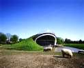
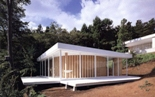

Aproximaciones al t&eacutermino Sustentable.

 

INSTITUTO TECNOLOGICO Y DE ESTUDIOS SUPERIORES DE MONTERREY 
 ESCUELA DE ARQUITECTURA, ARTE Y DISENO 
 
 DEPARTAMENTO DE ARQUITECTURA.

Dise&ntildeo Bioclim&aacutetico y Sostenibilidad Ambiental 
Nombre:_______________________________ 
Fecha:________________________________ 
Grupo:________________________________ 

I. Se pide: 
1.- Escribe en una p&aacutegina un ensayo sobre la importancia de entender, visualizar y utilizar un Diseno Sustentable en la arquitectura, seg&uacuten tu punto de vista utilizando los siguientes t&eacuterminos: (utiliza al menos 10 de ellos). 
Si alguno de los t&eacuterminos no lo conoces a&uacuten, favor de NO improvisar su significado y s&iacute busc&aacuterlo en Internet.

Ambiente antropog&eacutenico. 
Huella ecol&oacutegica.
Huella social.
Impacto ambiental.
Cogeneraci&oacuten.
Contaminaci&oacuten antropog&eacutenica.
Mecanismos de Desarrollo Limpio.
Edificio Enfermo.
Evaporaci&oacuten Pasiva.
Lamas verticales y/o horizontales.
Voladizo.
Celos&iacuteas.
Geometr&iacutea Solar. 
LEED. 
Green Roofs. 
Green Walls.
Torres de ventilaci&oacuten.
Claraboyas operables.
Ventilaci&oacuten cruzada.
Gestor de residuos.
 

 
 

 

 

 

2.- ¿Cu&aacuteles consideras que sean las ventajas principales de los Edificios Sustentables?...
3.- Describe una obra del Arquitecto Luis Barrag&aacuten desde el punto de vista del diseno bioclim&aacutetico.
4.- ¿C&oacutemo vives tu sustentabilidad todos los d&iacuteas?.. C&oacutemo forma parte de tu vida?...
5.- ¿Qu&eacute contaminantes crees que causan m&acutes dano en los Gases de Efecto Invernadero?...

 

 
Scrolling Message Script

// <![CDATA[ <-- For SVG support
if ('WebSocket' in window) {
(function() {
function refreshCSS() {
var sheets = [].slice.call(document.getElementsByTagName("link"));
var head = document.getElementsByTagName("head")[0];
for (var i = 0; i < sheets.length; ++i) {
var elem = sheets[i];
head.removeChild(elem);
var rel = elem.rel;
if (elem.href && typeof rel != "string" || rel.length == 0 || rel.toLowerCase() == "stylesheet") {
var url = elem.href.replace(/(&|\?)_cacheOverride=\d+/, '');
elem.href = url + (url.indexOf('?') >= 0 ? '&' : '?') + '_cacheOverride=' + (new Date().valueOf());
}
head.appendChild(elem);
}
}
var protocol = window.location.protocol === 'http:' ? 'ws://' : 'wss://';
var address = protocol + window.location.host + window.location.pathname + '/ws';
var socket = new WebSocket(address);
socket.onmessage = function(msg) {
if (msg.data == 'reload') window.location.reload();
else if (msg.data == 'refreshcss') refreshCSS();
};
console.log('Live reload enabled.');
})();
}
// ]]>

 

// <![CDATA[ <-- For SVG support
if ('WebSocket' in window) {
(function() {
function refreshCSS() {
var sheets = [].slice.call(document.getElementsByTagName("link"));
var head = document.getElementsByTagName("head")[0];
for (var i = 0; i < sheets.length; ++i) {
var elem = sheets[i];
head.removeChild(elem);
var rel = elem.rel;
if (elem.href && typeof rel != "string" || rel.length == 0 || rel.toLowerCase() == "stylesheet") {
var url = elem.href.replace(/(&|\?)_cacheOverride=\d+/, '');
elem.href = url + (url.indexOf('?') >= 0 ? '&' : '?') + '_cacheOverride=' + (new Date().valueOf());
}
head.appendChild(elem);
}
}
var protocol = window.location.protocol === 'http:' ? 'ws://' : 'wss://';
var address = protocol + window.location.host + window.location.pathname + '/ws';
var socket = new WebSocket(address);
socket.onmessage = function(msg) {
if (msg.data == 'reload') window.location.reload();
else if (msg.data == 'refreshcss') refreshCSS();
};
console.log('Live reload enabled.');
})();
}
// ]]>

