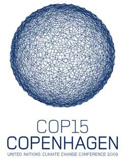
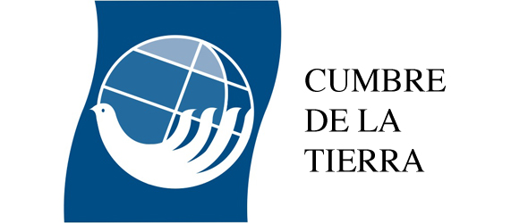

 Cámaras y cumbres internacionales:
INSTITUTO TECNOLOGICO Y DE ESTUDIOS SUPERIORES DE MONTERREY 
ESCUELA DE ARQUITECTURA, ARTE Y DISE&NtildeO 

DEPARTAMENTO DE ARQUITECTURA.

Dise&ntildeo Bioclim&aacutetico / Sostenibilidad Ambiental.
Nombre:_______________________________ 
Fecha:________________________________ 
Grupo:________________________________ 

Cámaras y cumbres internacionales sobre toma de conciencia internacional al medio ambiente. 

De acuerdo con Vaclav Smil (Profesor Canadiense economista/Faculty of Environment at the University of Manitoba in Winnipeg, Canada), el hombre, a diferencia de cualquier otra especie animal, ha usado más energía que toda la biosfera antes de la fotosíntesis oxidante, lo que equivale a un 10% de toda la energía procesada en la actualidad por la biosfera. 

Otra forma de describir la situación anterior es mencionar que nuestra especie, sólo una entre alrededor de 10 a 12 millones de especies, captura para consumir (y con frecuencia desperdiciar) alrededor de 45% de toda la actividad fotosintética terrestre y acapara más de la mitad de las reservas renovables de agua potable del planeta, tres cuartas partes absorbe la actividad agrícola. 
¿Y cuántos años más?... 
Principales etapas sobre toma de conciencia internacional sobre cambio climático.

1971Convención de Ramsar, Irán. 

19721era Cumbre de la tierra. Conferencia de Estocolmo sobre Medio Ambiente Humano. (Reino Unido).

1979Convención de Ginebra sobre la Contaminación Aérea. (ONU). 1ERA CONFERENCIA MUNDIAL SOBRE EL CLIMA, GINEBRA. 

1980Estrategia Mundial para la Conservación (IUCN). 

1983Protocolo de Helsinki sobre la Calidad del Aire. 

1983Comisión Mundial sobre Medio Ambiente y Desarrollo (ONU).

1987Protocolo de Montreal sobre la Capa de Ozono. (ONU). Para proteger la atmósfera de Ozono (O3) al eliminar los CFC y otros gases que producen su adelgazamiento. 

1987Nuestro Futuro Común (Comisión Brundtland). (ONU).

1988La asamblea general de la ONU declara que el cambio climático es una preocupación que la humanidad compare y crea el Panel Intergubernamental sobre el Cambio Climático (PCC) para revisar el estado del conocimiento científico de éste tema, sobre su impacto social y económico y para establecer estrategias que permitan elaborar una Convención Internacional sobre cambio climático. 

1990Libro Verde sobre el Medio Ambiente Urbano. (UE). 1ER REPORTE DEL PCC. "La tierra parece calentarse y las actividades humanas son las responsables"… Ante el cambio climático es necesaria una plataforma política entre países para enfrentar sus consecuencias. 

19922da Cumbre de la Tierra. (Río de Janeiro). Para estabilizar las emisiones de gases de efecto invernadero (GEI) para el año 2000, se crea se crea la Conversión Marco sobre cambio climático de las Naciones Unidas (CMCC), tratado internacional clave para disminuir el calentamiento global y enfrentar sus consecuencias. 

1995 2DO REPORTE DEL PCC. México.

1997 Protocolo de Kioto. Documento en el que se plantean compromisos para disminuir 5% de los gases de efecto invernadero (GEI) para los años 2008 a 2012, en relación de los niveles de 1990, así como crear el "mercado de carbono, que enuncia los principios de intercambio de emisiones de dióxido de carbono (CO2).

2000Conferencia de La Haya sobre el Cambio Climático.

2001 3ER REPORTE DEL PICC. México. 

2001Acuerdos de Marrakech. En la reunión de la ONU se firman las reglas para llevar a cabo los enunciados del Protocolo de Kioto. 

2001Convención de Estocolmo. Contaminantes orgánicos persistentes. 

20023era Cumbre de la tierra. Johannesburgo sobre el Desarrollo Sostenible. (ONU). Aunque los países altamente industrializados son responsables por la mayoría de gases de efecto invernadero presentes en la atmósfera, varios EU no han ratificado. 

2005En Australia y en Canadá entra en vigor el Protocolo de Kioto.

20074TO REPORTE DEL PICC. México. Australia ractifica el Protocolo e insta a EU a hacerlo. 

20095TO REPORTE DEL PICC. Copenhague. Conferecia de las Naciones Unidas sobre el Cambio Climático. Busca firmar el Protocolo de Copenhague para sustituir al de Kioto, cuya vigencia termina en el 2012. 

PREGUNTAS: 
1.- ¿Porqué se crea el Panel intergubernamental sobre el Cambio Climático?...¿Cada cuántos años se a llevado a cabo?... 
2.- ¿Porqué Estados Unidos no ha firmado el Protocolo de Kioto?... ¿Cuál es son sus intereses?... 
3.- En 1987... ¿Cuál fue el acontecimiento más importante de la Comisión Brudtland en la ONU?... 
4.- ¿Cuáles son los apartados principales del Protocolo de Copenhague?... 

