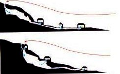
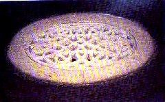
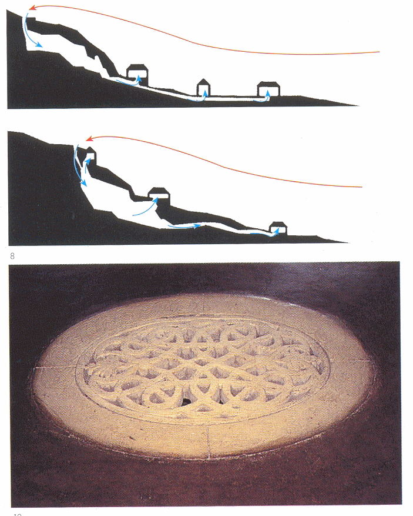
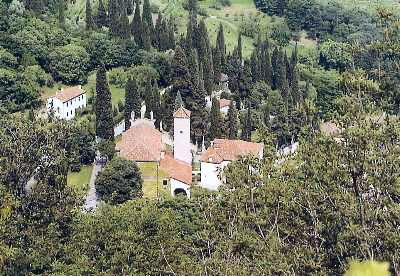

 Ville Costozze INSTITUTO TECNOLOGICO Y DE ESTUDIOS SUPERIORES DE MONTERREY ESCUELA DE ARQUITECTURA, ARTE Y DISE&NtildeO DEPARTAMENTO DE ARQUITECTURA. Dise&ntildeo Bioclim&aacutetico / Sostenibilidad Ambiental. Nombre:_______________________________ Fecha:________________________________ Grupo:________________________________ El enfriamiento convectivo se alcanza empleando directamente masas de aire frío. Un notable ejemplo de estrategia de enfriamiento de aire la tenemos en las Villas Costozza, en Italia, cerca de Vicenza. Estas viviendas están edificadas en una ladera que se desarrolla sobre grandes cuevas naturales. El aire penetra en estás cuevas, embolsándose y enfriándose de forma espontánea, y las villas, situadas sobre ellas, toman ese aire frío a través de grandes rejillas (alcantarillas de mármol). Palladio conocedor de este fenómeno lo empleo en su villa Rotana, utilizando el sótano en lugar de las cuevas. The Villa Rotonda draws cool air from the cellar below. This cool air is then challennelled through the building core distribuiting itself evenly throughout the building < The Costozza villas, near Vicenza, benefited from an unusual cooling system. They were built above natural caves, and the cool air from the caves was used to ventilate the villas via marble grilles. Palladio wrote of his fascination for the system and tried to apply it in his own work.     PREGUNTAS: 1.- Explica el proceso de enfriamiento convectivo de las Villas Constozze... 2.- ¿Qué significa "Marble Grilles"... 3.- Explica como el proyecto de las Oficinas de Datagroup en Pliezhausen, Alemania de Kauffmann Theiling & Partners, utiliza el enfriamiento convectivo?...     X   Para saber más.... ACTUACIONES DIRECTAS DE ENFRIAMIENTO en NEILA Francisco J. Arquitectura Bioclimática en un entorno sostenible. pp (320-332) Editorial Munilla-Lería. Madrid 2004. 

