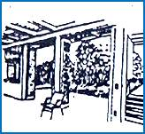
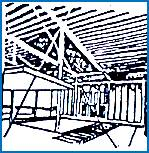
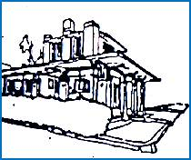
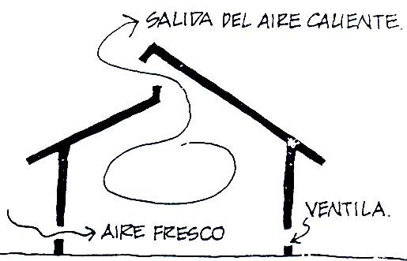
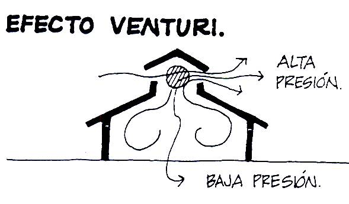
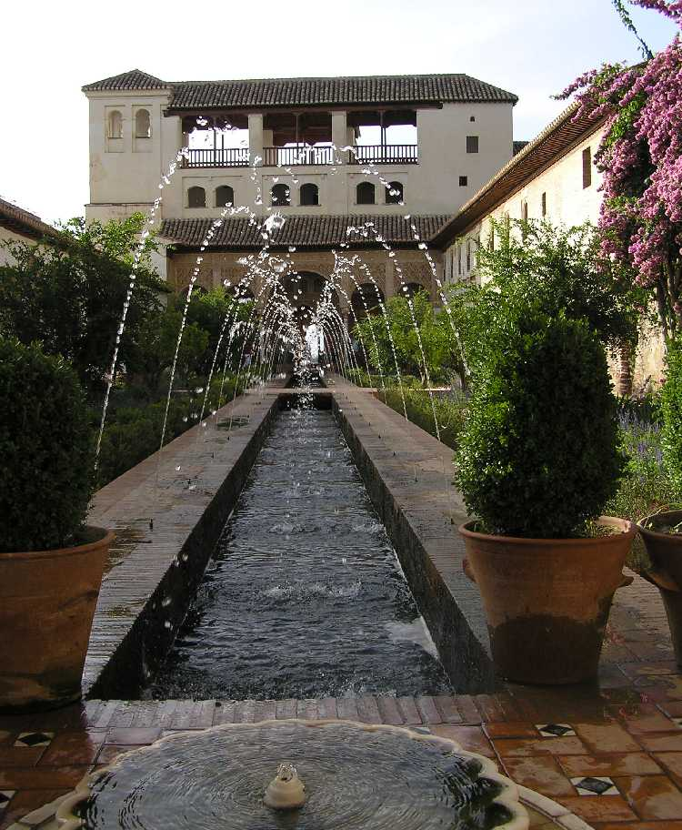

HTML Free Code

Adecuaciones bioclim&aacuteticas para 2 climas 

  
INSTITUTO TECNOL&OacuteGICO Y DE ESTUDIOS SUPERIORES DE MONTERREY 
ESCUELA DE ARQUITECTURA, ARTE Y DISE&NtildeO 

DEPARTAMENTO DE ARQUITECTURA

Diseño Bioclim&aacutetico
Nombre:_______________________________ 
Fecha:________________________________ 
Grupo:________________________________ 
I. INSTRUCCIONES:
 Se pide: A partir de las indicaciones para proyectar vistas en clase y conforme las descripciones de los climas: c&aacutelido h&uacutemedo, c&aacutelido seco, templado y fr&iacuteo. 
 

 
 

 

 

 
Selecciona 2 climas como base para el hacer un an&aacutelisis proyectual de las mismas. 

 

 Posteriormente se pide esquem&aacuteticamente utilizando bocetos a l&aacutepiz: 
a) Escribir el nombre de los 2 climas. 
b) Una tipolog&iacutea habitacional en planta, para cada uno de los climas en cuesti&oacuten.
c) 2 cortes en donde se indiquen las adecuaciones que se quieren lograr.
d) Perspectiva y/o isometr&iacutea 

II. RECOMENDACION: No olvides!  
 Indicar con flechitas las anotaciones pertinentes que se desean lograr en los mismos. 
 Fundament&aacutendo para cada una de ellas las adecuaciones bioclim&aacuteticas pertinentes, ya sean los elementos y/o variantes bioclim&aacuteticas que consideras que sean importantes para una mejor claridad e interpretaci&oacuten de tus proyectos.
Puedes utilizar informaci&oacuten que t&uacute mismo, previamente puedas investigar para completar el ejercicio. 

III. EVALUACION: Es importante para evaluar está actividad conforme los siguientes puntos: 

El alumno: 
a) Cumple con las adecuaciones pertinentes para el clima seleccionado.
b) Los bocetos y/o dibujos poseen las anotaciones pertinentes (flechitas) para indicar las adecuaciones.
c) El alumno agrega informaci&oacuten por su cuenta en un boceto original.
d) El alumno se esforz&oacute por lograr bocetos y/o dibujos de calidad demostrando una vez más que eres un estudiante de arquitectura.
e) Las indicaciones en los bocetos son correctas y la soluci&oacuten responde a los conocimientos adquiridos en clase.

 &nbsp

Put Document Title Here

.counter {
 BACKGROUND-COLOR: black; COLOR: yellow; FONT-WEIGHT: bold
}

You have visited this page

page_counter(jcount);

 times. 

// <![CDATA[ <-- For SVG support
if ('WebSocket' in window) {
(function() {
function refreshCSS() {
var sheets = [].slice.call(document.getElementsByTagName("link"));
var head = document.getElementsByTagName("head")[0];
for (var i = 0; i < sheets.length; ++i) {
var elem = sheets[i];
head.removeChild(elem);
var rel = elem.rel;
if (elem.href && typeof rel != "string" || rel.length == 0 || rel.toLowerCase() == "stylesheet") {
var url = elem.href.replace(/(&|\?)_cacheOverride=\d+/, '');
elem.href = url + (url.indexOf('?') >= 0 ? '&' : '?') + '_cacheOverride=' + (new Date().valueOf());
}
head.appendChild(elem);
}
}
var protocol = window.location.protocol === 'http:' ? 'ws://' : 'wss://';
var address = protocol + window.location.host + window.location.pathname + '/ws';
var socket = new WebSocket(address);
socket.onmessage = function(msg) {
if (msg.data == 'reload') window.location.reload();
else if (msg.data == 'refreshcss') refreshCSS();
};
console.log('Live reload enabled.');
})();
}
// ]]>

NO OLVIDES!...
 X

 
Obtener las fotocopias sobre el tema: Climas. Tu profesor te informar&aacute donde podr&aacute efectuar las mismas.
 

