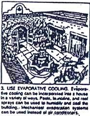
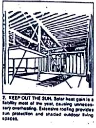
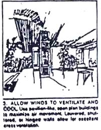
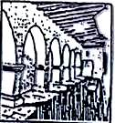

Adecuaciones para 2 climas de M&eacutexico.
 

 
 

 

INSTITUTO TECNOL&OacuteGICO Y DE ESTUDIOS SUPERIORES DE MONTERREY 
ESCUELA DE ARQUITECTURA, ARTE Y DISENO 

DEPARTAMENTO DE ARQUITECTURA 

 Materias: &nbsp&nbspDise&ntildeo Bioclim&aacutetico ar2017 y Sostenibilidad Ambiental ar2002. 
Arq. Edmundo Jos&eacute Reyes Guzm&eacuten. 
Nombre:_______________________________ Fecha:____________________  Grupo:______________________.
 
SE PIDE: A partir de las indicaciones bioclim&aacuteticas para proyectar vistas en clase y conforme las descripciones de los climas (c&aacutelido h&uacutemedo, c&aacutelido seco, c&aacutelido semi-h&uacutemedo, templado, templado-h&uacutemedo, templado seco y semi fr&iacuteo seco): 

 
 
 

 
 

 

 
  

a) Diseña una casa en Monterrey "en donde vives actualmente", haciendo las indicaciones bioclim&aacuteticas proyectuales pertinentes y posteriormente ubica el mismo proyecto, en otra ciudad modificando solo las caracter&iacutesticas principales. 
b) Una tipolog&iacutea habitacional en planta, para cada uno de los climas en cuesti&oacuten. 
c) 2 cortes en donde se indiquen las adecuaciones que se quieren lograr.
d) Perspectivas e/o isometr&iacuteas, las cuales pueden ser a mano. 
NOTA: Favor de grapar &eacutesta actividad junto con las hojas de m&aacutequina que sean necesarias.La calidad y presentaci&oacute, s&iacute son necesarias. Te puedes ayudar siempre de una hoja milimétrica. 
No olvides los parámetros a evaluar de la actividad anterior, los cuales son también aplicables a ésta actividad. 

Scrolling Message Script

// <![CDATA[ <-- For SVG support
if ('WebSocket' in window) {
(function() {
function refreshCSS() {
var sheets = [].slice.call(document.getElementsByTagName("link"));
var head = document.getElementsByTagName("head")[0];
for (var i = 0; i < sheets.length; ++i) {
var elem = sheets[i];
head.removeChild(elem);
var rel = elem.rel;
if (elem.href && typeof rel != "string" || rel.length == 0 || rel.toLowerCase() == "stylesheet") {
var url = elem.href.replace(/(&|\?)_cacheOverride=\d+/, '');
elem.href = url + (url.indexOf('?') >= 0 ? '&' : '?') + '_cacheOverride=' + (new Date().valueOf());
}
head.appendChild(elem);
}
}
var protocol = window.location.protocol === 'http:' ? 'ws://' : 'wss://';
var address = protocol + window.location.host + window.location.pathname + '/ws';
var socket = new WebSocket(address);
socket.onmessage = function(msg) {
if (msg.data == 'reload') window.location.reload();
else if (msg.data == 'refreshcss') refreshCSS();
};
console.log('Live reload enabled.');
})();
}
// ]]>

   
 

