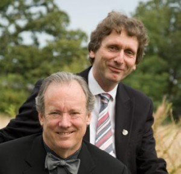
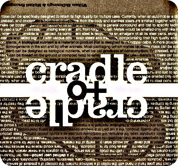
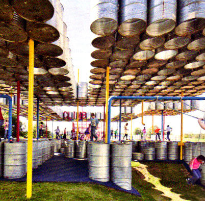
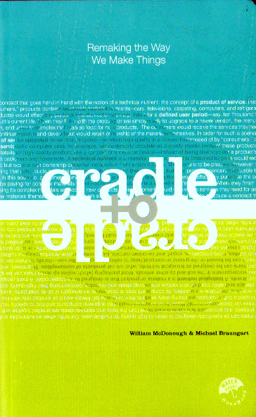

 Cradle to Cradle 

 
 
INSTITUTO TECNOLOGICO Y DE ESTUDIOS SUPERIORES DE MONTERREY 
ESCUELA DE ARQUITECTURA, ARTE Y DISENO 

DEPARTAMENTO DE ARQUITECTUA.

Diseno Bioclim&aacutetico
Nombre:_______________________________ 
Fecha:________________________________ 
Grupo:________________________________ 

"Remaking the we make things"... 

Contesta AMPLIAMENTE seg&uacuten tu lectura: 
1.- Qu&eacute significa "Instead of Cradle the grave, "cradle to cradle"?... Ejemplif&iacuteca: 
2.- Qu&eacute significa que los productos necesariamente necesitan estar en un ciclo de vida, ya sea a trav&eacutes de "su proceso y manufactura" en el que no sean sus partes utilizadas como basura sino que vuelvan a entrar en un nuevo ciclo responsable y de reuso?... 
3.- Seg&uacuten WMc.D... Porqu&eacute el proceso de la humanidad a partir de la Revoluci&oacuten Industrial ha sido un grave error de diseno?...
4.- Seg&uacuten WMc.D... Porqu&eacute los seres humanos necesitamos un cambio radical en nuestra forma de interactuar con el mundo que nos rodea?...
5.- Un material, por el simple hecho de ser un producto para el reciclaje, no se convierte autom&aacuteticamente en benigno desde el punto de vista ecol&oacutegica Explica... Porqu&eacute?.. 
6.- Cu&aacutel es la diferencia entre eco-eficiencia y eco-efectividad ?... 
7.- Es posible disenar los productos de modo que los materiales se reciclen en el mismo uso, o bien se reciclen "hacia arriba", es decir que el siguiente uso tenga más valor que el actual?.. Ejemplifica y justifica tu respuesta.
8-9.- Explica AMPLIAMENTE alguno de los siguientes cap&iacutetulos del libro (1/2 p&aacutegina). 

1. Cuesti&oacuten de diseno.
2. Porqu&eacute lo menos no es bueno?... 
3. Eco-efectividad.
4. Basura = Alimento.
 
10.- Cradle to Cradle, consiste en fabricar de la cuna a la cuna, pensando en qu&eacute va a pasar con aquello que estamos fabricando cuando ya no sea &uacutetil. Qu&eacute relaci&oacuten encuentras entre la tem&aacutetica del libro y la Sustentabilidad Ambiental?.. Justifica tus respuestas (no rollo). 

"Form follows not just function, but the evolution ot the medium itself"... 
 

 "Nature doesn't have a design problem, people do"...   

  
 
"modern indusries still operates according to paradigms that deveolped when humans had a very different sense of the world"...
 

 "A question of desing"... 

 

 

DUDAS?...
 

X

 

Recomendaci&oacuten: Prepara tu Bibliotecta de libros!... de Arquitectura Sustentable(Mexico)o Sostenible (Espana):
MC DONOUGHT, William; BRAUNGART,Michael. CRADLE TO CRADLE. Remaking the Way We Make Things . North Point Press. NY. 2002. No olvides que mi correo es: 
 Arq. Edmundo J. Reyes Guzman 

Deseas mandar un e-mail?...

