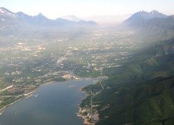
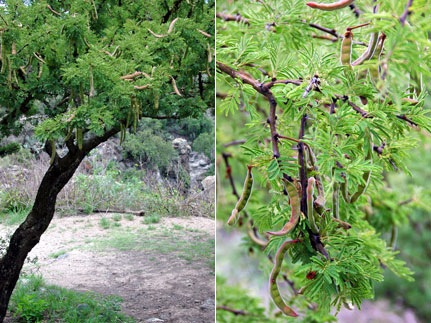
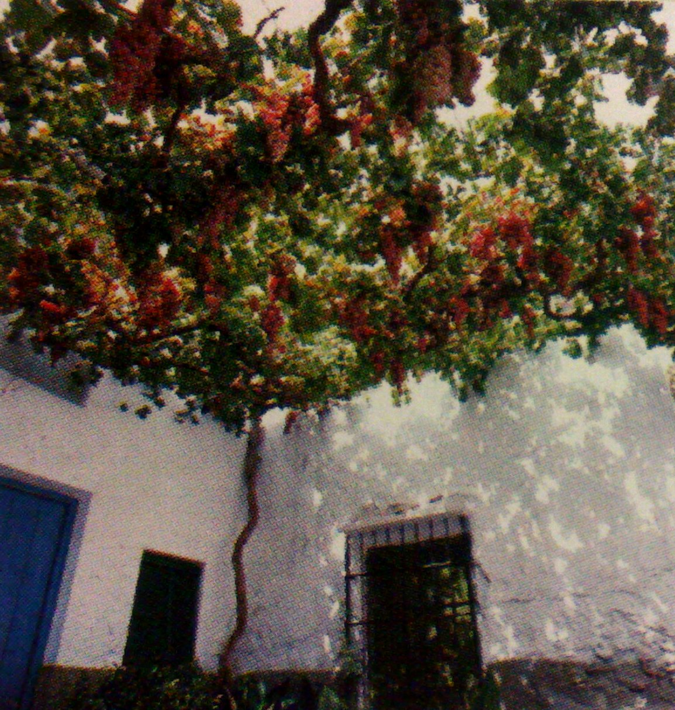
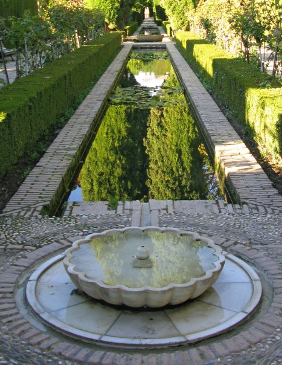
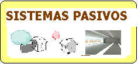

En busca del hogar 
 confortable. 2 

 

INSTITUTO TECNOLÓGICO Y DE ESTUDIOS SUPERIORES 
 DE MONTERREY
ESCUELA DE ARQUITECTURA, ARTE Y 
 DISEÑO
DEPARTAMENTO DE 
 ARQUITECTURA
Arq. Edmundo José Reyes 
 Guzmán
En Busca del hogar confortable. Segunda 
 parte.

Auxiliándose de elementos como la orientación, 
 materiales constructivos, colores, texturas, vegetación, y formas del 
 edificio, entre otros, es posible mejorar las condiciones de comodidad 
 de la vivienda, ya sea desde el proyecto, o una vez ya 
 construida.
ORIENTACIÓN
De la ubicación que se dé a los 
 diferentes espacios de un edificio, dependerá en gran parte el 
 confort con que se cuente, pues esto determinará tanto 
 el asoleamiento que recibimos como su 
 ventilación.
Una buena solución debe tomar en cuenta que todas las 
 habitaciones y espacios del edificio tengan una orientación 
 óptima. 
Es necesario atender desde el inicio las 
 condiciones del lugar, y a veces porque los aparatos de 
 aire acondicionado nos brindan el confort que olvidamos de darle a las 
 edificaciones las características de ventilación, de 
 asoleamiento, de colores, de aislantes y el consumo de energía 
 es mucho.
La orientación que se debe más de cuidar 
 es el poniente, por lo que debe de evitarse el colocar grandes aberturas 
 en esta posición, sin olvidar que durante el invierno, por el movimiento 
 de la tierra, los rayos solares se inclinan más hacia el 
 sur.
El norte, es de las orientaciones que 
 presentan más beneficios para las áreas de descanso, como las 
 recámaras y salas de estar, pues no se encuentra expuesta al 
 sol.
El sol, no obstante no debe de 
 considerarse como un enemigo natural del diseño, pues existen áreas que 
 lo requieren, como en el caso de las lavanderías, tendederos, 
 baños y cocina donde su presencia es necesaria para mantener 
 seca la zona, y evitar la formación de moho y 
 hongos.
Otros espacios, como el caso de los pasillos, 
 escaleras y closets pueden ser considerados como “comodines” 
 pues son áreas en las que no se pasa mucho tiempo por lo que pueden ser 
 colocados indistintamente sin causar molestias. 
 
Es preciso considerar que preferentemente a ninguna 
 habitación debe privársele totalmente de los rayos 
 solares.

VENTILACIÓN 
 
El viento es otro de los elementos 
 que ayudan a controlar la temperatura interior de una vivienda y su 
 dirección es otra de las determinantes para ubicar las habitaciones. 
 
Los vientos dominantes vienen del Golfo 
 de México entran por el Cañón del Huajuco, cruzan la Ciudad y se puede 
 tener una ventilación cruzada. 

El viento frío viene del noroeste, pero 
 en verano del sureste del Cañón del Huajuco rumbo a 
 Santa Catarina.
 Para aprovechar los vientos las aberturas (puertas y 
 ventanas) deben ser ubicadas al sureste y asegurar que siempre exista 
 una salida que garantice la circulación del aire, provocar que haya 
 vientos cruzados. 
Otra forma de conseguir el paso del aire, haciendo salir 
 el caliente es utilizando diferencias de presión. 
 
El aire caliente tiende a subir, por lo que 
 colocando “tiros de ventilación”, es decir aberturas en 
 las partes altas de la casa, se logra que éste salga, provocando a la 
 vez la entrada de aire fresco en las partes bajas de la casa. 
 Si, a la vez se loga una ventilación cruzada en la parte 
 alta de las torres, se produce una diferencia de presión entre el 
 interior y el exterior llamado Efecto Venturi.
Construir una torre de ventilación no es 
 complicado, pues se pueden utilizar los cubos de escalera colocando 
 ventanas en la parte superior de ellos.
 
 
VEGETACIÓN Y 
 HUMEDAD.
Integrar la vivienda a la 
 naturaleza no tiene como único fin el ornato, sino que 
 el conjunto forma un microclima que puede ser usado para controlar los 
 ambientes. 
El universo de opciones de vegetación que pueden ser 
 utilizados son tan amplios como los usos que se les puede dar.

La variedad va desde los árboles, arbustos y 
 pastos, hasta las trepadoras, cada una con una función 
 específica. 
Los árboles pueden ser usados tanto como para provocar 
 sombra sobre la casa como para refrescar el aire que a través de ellos 
 pasa. 
La ubicación de éstos, como protección solar, es 
 al sur y al poniente del 
 edificio.

Se debe considerar también, dependiendo de los 
 requerimientos particulares si éstos serán de los que conservan la hoja 
 durante todo el año (perenne), o si la pierden 
 (caducifolios). 
Los segundos son apropiados cuando se quieren detener los 
 rayos solares en invierno pero se quiere permitir su paso durante el 
 invierno.
En cuanto a la función de los árboles como refrescantes 
 del ambiente, el aire al pasar a través de sus hojas registra una 
 pérdida de temperatura por la humedad que contiene y 
 por la sombra que provoca.
Los árboles producen un enfriamiento evaporativo 
 directo y un humedecimiento del aire por 
 evapotranspiración vegetal.

Por otra parte los arbustos, además de las funciones 
 anteriores, sirven para dirigir los vientos hacia donde 
 se desee.
Los pastos además de permitir la 
 asimilación del agua en el suelo, se convierten en una 
 capa que evita la reflexión solar.

Son apropiados para colocarse próximo a las ventanas 
 evitando el deslumbramiento hacia el interior. 
 
Las trepadoras o enredaderas tienen su 
 sitio especial como protectores contra el calor pues al colocarse sobre 
 las losas además de producir sombra en ella, forman una cámara de aire 
 que hace circular el aire caliente remplazándolo por otro más fresco. 
 

De las misma manera se pueden sombrear paredes, procurando 
 dar preferencia a las que formen parte de la fachada poniente. 
 
Íntimamente relacionado con la vegetación se encuentra la 
 humedad. 
Al pasar el aire caliente a través de una 
 cortina de agua, esta tiende a evaporarse. 
 Por ello, la 
 temperatura del aire desciende, pues el agua toma energía calorífica del 
 aire para cambiar de estado líquido a gaseoso. Este es el principio de 
 los aparatos de aire lavado.
Tomando como base este principio, resulta 
 conveniente colocar fuentes o espejos de agua entre los 
 vientos dominantes y la casa, de esta manera, el aire 
 que llega al interior será de una temperatura menor que en el exterior. 
 
Una manera de reducir el calor de una forma práctica, es 
 colocando recipientes de barro, jarros, llenos de agua, por donde entra 
 el aire, como en las ventanas, así se enfriará el viento que pase a 
 través de ellos.

 

 

 

 
 
 Arq. Edmundo J. 
 Reyes

 

¿SUGERENCIAS?.. 
X

     No 
 olvides estudiar con tiempo para tu examen!... 
 ¿Deseas mandar un e-mail?...

