Flujos de ventilación.

 
 
INSTITUTO TECNOL&OacuteGICO Y DE ESTUDIOS SUPERIORES DE MONTERREY 
ESCUELA DE ARQUITECTURA, ARTE Y DISE&NtildeO 
DEPARTAMENTO DE ARQUITECTURA

Diseño Bioclim&aacutetico/ Sustentabilidad Ambiental
Nombre:_______________________________ 
Fecha:________________________________ 
Grupo:________________________________ 

Del libro: OLGYAY, Victor. Arquitectura y climas. Manual de Diseño Bioclimático para Arquitectos y Urbanistas.
 Editorial Guztavo Gili. Barcelona, 1998.

Modelos de flujo de aire en el interior de los edificios. 
Las fuerzas que proporcionan la ventilación natural en la edificación pueden agruparse segñun las siguientes catagorías: 

movimiento del aire producidos por diferencia de presión. 
intercambio del aire, por diferencia de temperaturas. 

Ambas fuerzas pueden actuar solar, en conjunto o en oposición, siempre dependiendo de las condiciones atmosféricas y del diseño del edificio. 

 
   Ventilación producida por las fuerzas del viento . 
   Características del movimiento del aire . 
   Efecto de Inerncia . 
   Divisiones interiores . 

SE PIDE: 
Relaciona la imagén correspondiente (túnel del viento del flujo de ventilación interna) con la letra correspondiente a su descripción.

  
______________

  
______________
 

  
______________

  
______________

  
______________

  
______________
 

  
______________

  
______________

  
______________

  
______________
 

    
 

  
______________

  
______________
 

 

  
______________

  
______________
 

 

  PLANTAS sin divisiones
(a) Planta.  Para recibir los movimientos del aire, una casa debe tener una abertura de entrada(preferiblemente situada donde la presión es positiva) y una de salida (donde es negativa o de succión). Es este ejemplo falta una de dichas aberturas, por lo tanto no se produce movimiento del aire interior. 

(b) Planta.  La combinación de una abertura de gran tamaño para la entrada de aire con una pequeña para la salida produce un incremento de las velocidades en el exterior del edificio, como consecuencia, el efecto refrescante se pierde. 
(c) Planta.  El máximo flujo de aire se produce cuando grandes aberturas de igual tamaño se sitúan en fachadas opuestas. Se ve además la considerable cantidad de flujo de aire a mayor velocidad que la que fluye en el exterior del edificio. 
(d) Planta.  Si las aberturas no se encuentran centradas respecto al flujo de aire exterior, se producirá un flujo interior asimétrico. La presión exterior dirige el flujo en ángulo. 
(e) Planta.  La mayor velocidad se produce cuando se combina una entrada de aire pequeña con una salida grande. Obsérvese cómo la mayor velocidad del aire se produce justo después de la abertura.
(f) Planta.  Cuando las fuerzas externas ejercen presión lateral sobre el flujo inicial, el flujo resultante será asimétrico. Aquí se muestra un ejemplo con una ventana que posee una lama vertical en uno de sus lados. 
   PLANTAS (con divisiones) y CORTES 
(g) Planta.  Cualquier obstáculo situado fuera del modelo de recorrido no interferirá en la dirección del flujo, ya que la corriente de aire principal es aproximadamente ocho veces más poderosa que los posibles remolinos que pudieran formarse.
(h) Corte.  Si se coloca la entrada de aire a una altura baja y la salida cerca del techo (altura alta), el flujo resultante tendrá una agradable desviación hacia abajo, a pesar de la posición de la salida. 
(i) Planta.  Las divisiones paralelas al flujo parten el recorrido pero mantienen las velocidades adecuadas. 
(j) Corte.  Disposición con abertura de entrada situada en al parte superior. Las irregularidades en las superficies exteriores originan fuerzas hacia arriba, lo cual disminuye el efecto de refrescamiento. 
(k) Planta.  Las particiones perpendiculares al flujo incial alteran el recorrido, la recámara trasera tiene un escaso suministro de refrescamiento. 
(l) Corte.  Un voladizo situado inmediatamente encima de la ventana produce un efecto desfavorable; la desequilibrada presión externa dirige el flujo hacia arriba, alejándolo de la zona de estar. 
(m) Corte. Efecto de una persiana veneziana colocada hacia abajo. El resultado es un modelo de aire difuso correcto y bien dirigido. 
(n) Planta.  Cualquier división que intercepte el modelo inicial alterará el flujo de forma significativa: reducirá su velocidad, la habitación de la parte superior no recibirá movimiento de aire, y en la de abajo el flujo será muy escaso.

 Ventilación producida por las fuerzas del viento .   
El movimiento del aire que rodea una edificación, crea zonas de baja presión en los lados adyacentes a la fachada de mayor exposición. A sotovento se producirá una zona de sombra de viento con baja presión.
 El emplazamiento de las aberturas es más eficaz si se colocan las entradas en las zonas de alta presión y las salidas en las de baja. La proporcioón de intercambio de aire se encuentra regida por las diferencias de presión y por la eficiencia regida por las diferencias de presión y por
 las diferencias de presión por la eficiencia de las aberturas expuestas. 

 Características del movimiento del aire .  

 Efecto de Inerncia .  
Es evidente que grandes aberturas situadas en extremos opuestos y colocadas en las zonas de alta y baja presión, respectivamente, proporcionarán el máximo intercambio de aire en el interior del espacio. Sin embargo, para el período de verano, la velocidad del aire es más importante que la antidad del aire intercambiado. 
Utilizando pequeñas aberturas de entradas, se produce el "Efecto Venturi", asegurando velocidades máximas del aire en el interior de la construcción. Para presiones externas iguales, una entrada y una salida colocadas simétricamente darán como resultado un modelo de flujo interior perpendicular. Con aberturas situadas de forma asimétrica, en concordancia con diferentes componentes de presión externa, el aire penetrará oblicuamente. 
El flujo de interior tendrá por inercia, a seguir su dirección original hasta que, debido a las diferencias de presión, se desviarán hacia la salida. Siempre que se intercepte una de las presiones externas, se originarán patrones de flujo asimétricos similares (por ejemplo, con un marco de ventana). 
 Divisiones interiores   
Los modelos de flujo de interior dependen de las aberturas, manteniéndose independientes de cualquier otra característica geométrica de la habitación. Un flujo directo asegura la rapidez del movimiento del aire, y cualquier cambio en su dirección reducirá cierto efecto. Cualquier cambio brusco en su curso, ya sea ocasionado por el mobiliario, el equipamento o alguna división, reducirá la velocidad del aire de forma muy destacable. 

Nota: 
Túnel de humos: 
El funcionamiento del equipo se puede explicar así: el equipo posee generalmente una cámara de pruebas de 74 cm. por 50 cm. con tres centímetros de alto protegida por un vidrio antirreflejos; en ella el investigador coloca un corte, o elevación, o perfil en escalas 1:50, 1:100, 1:200 u otra, de tres centímetros de alto. El humo blanco espeso generado por la máquina de humo y un filtro generan un frente de líneas de humo de 3mm. de diámetro que pasan por el modelo. 
Estas líneas de humo al interactuar con los cortes, dibujan, contra fondo negro, en tiempo real y en 2-D el comportamiento del viento. Posteriormente, la velocidad del viento (líneas de humo) en la cámara de pruebas se escala a la velocidad real.
  
  

 

 NO dejes para mañana lo que puedas hacer HOY!...

¿Para saber más...

X

 

 Un tunel de vientos bidimensional trabaja con modelos de maqueta efectuadas en grispardo o plexiglás. Las líneas que indican el flujo de aire son huellas del humo del queroseno entrando en el túnel, a través de una mangera.En ingeniería, un túnel de viento o túnel aerodinámico es una herramienta de investigación desarrollada para ayudar en el estudio de los efectos del movimiento del aire alrededor de objetos sólidos. Con esta herramienta se simulan las condiciones que experimentará el objeto de la investigación en una situación real.

Existe el software Wind Tunnel 2D el cual descargamos de: 
Wind Tunnel 2D

 ¿Deseas mandar un e-mail?...

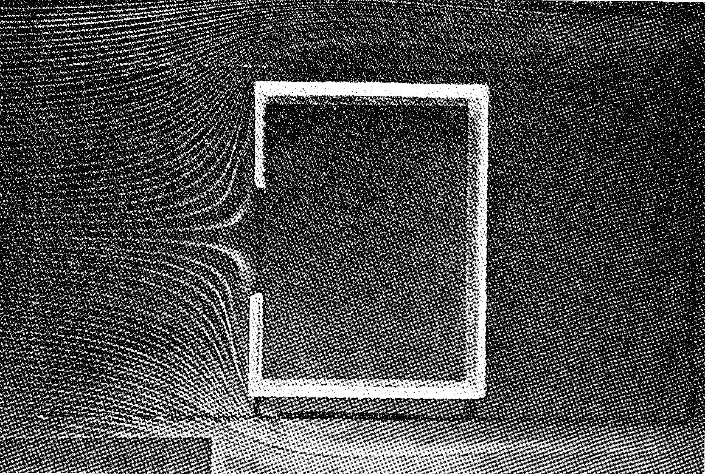
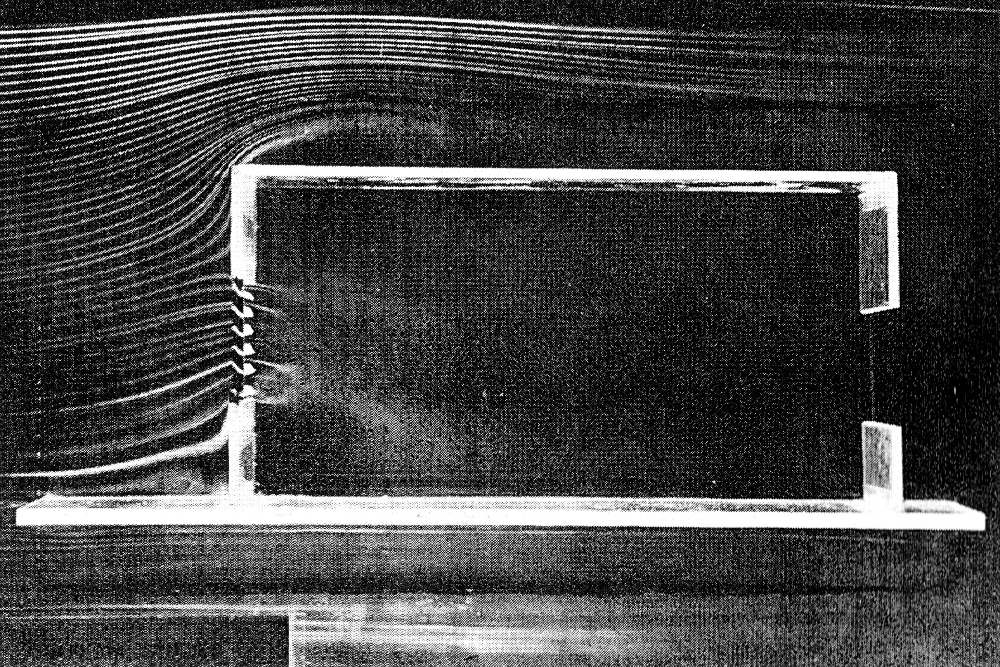
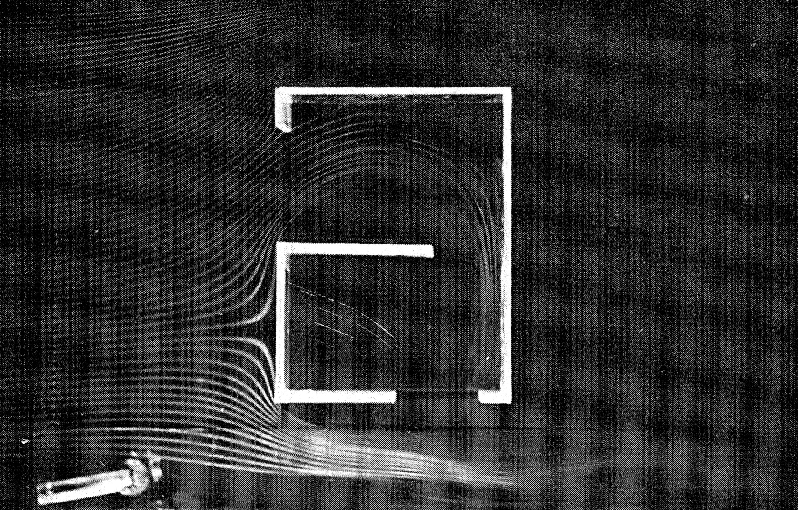
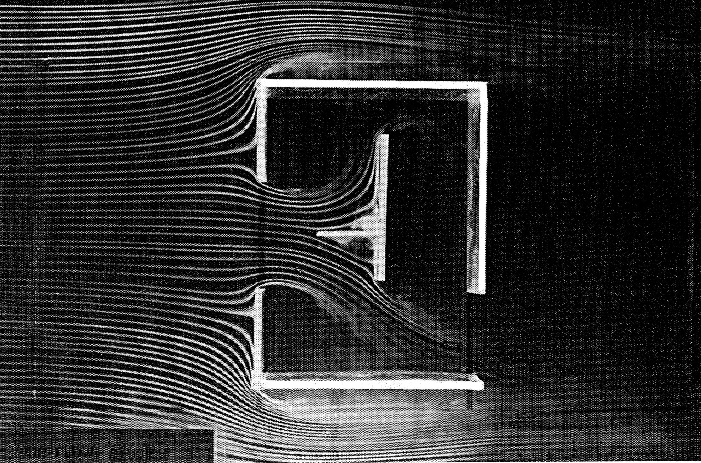
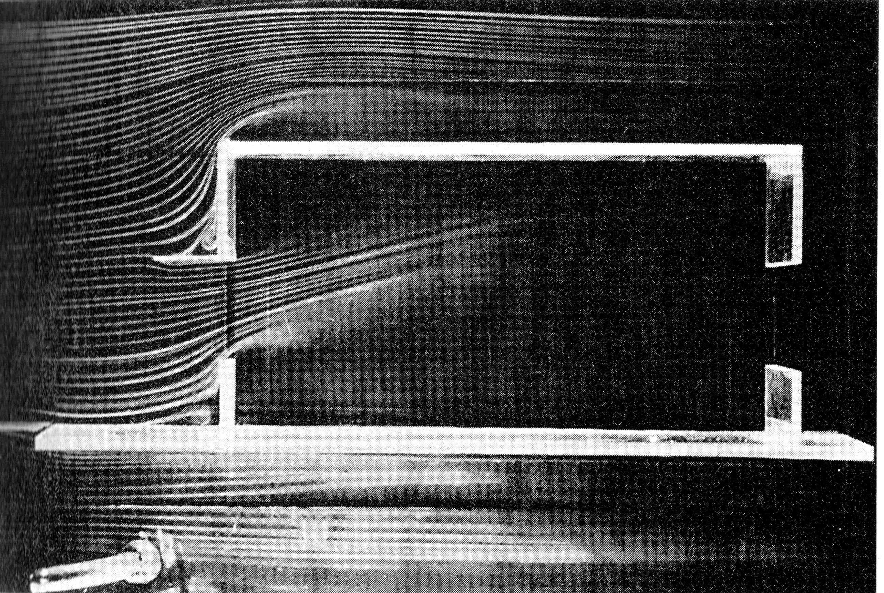
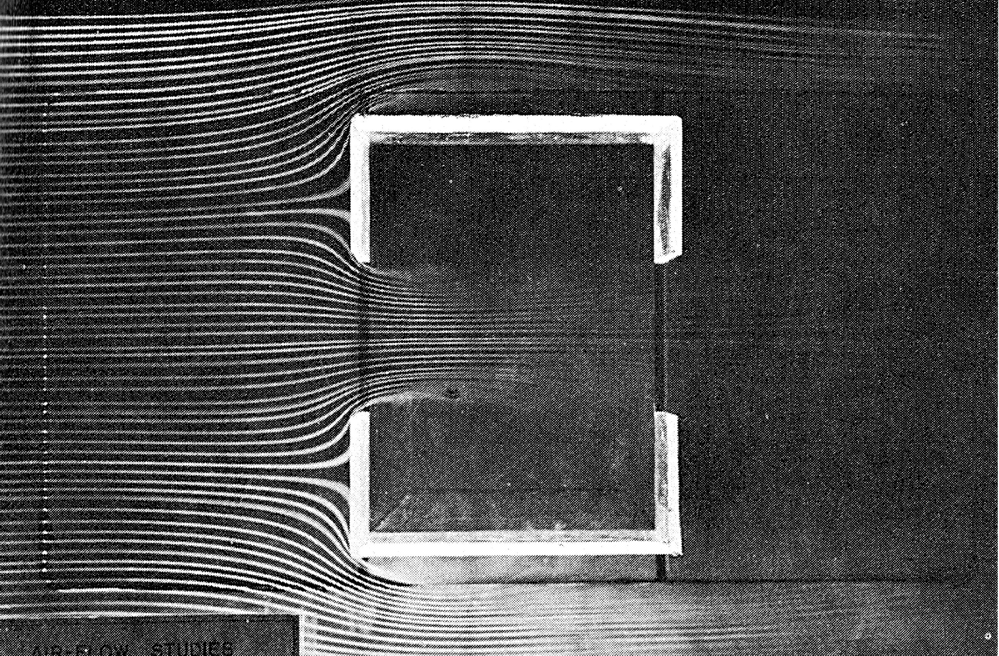
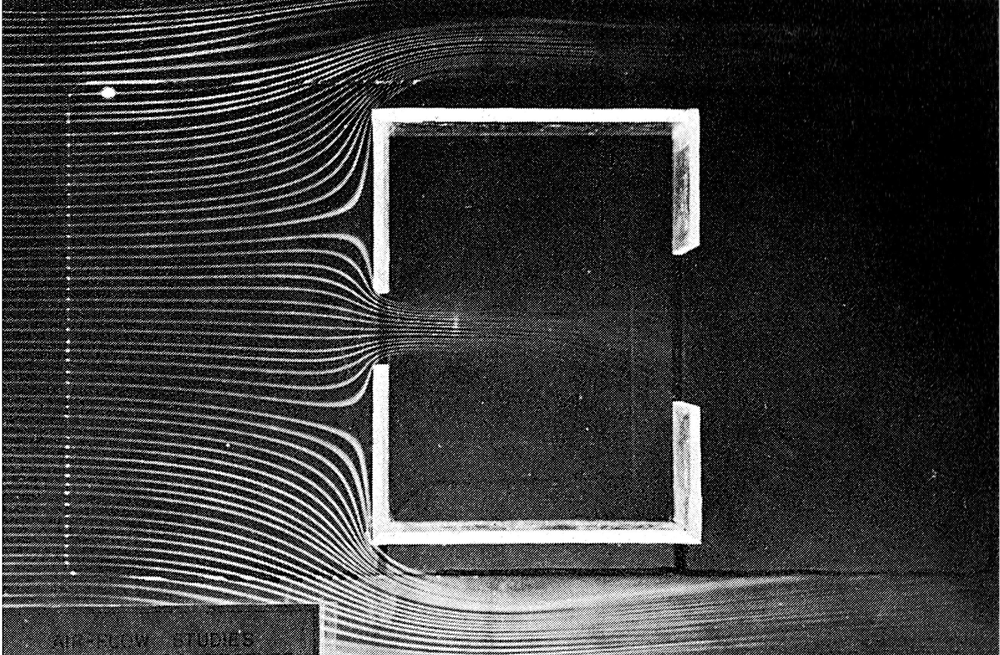
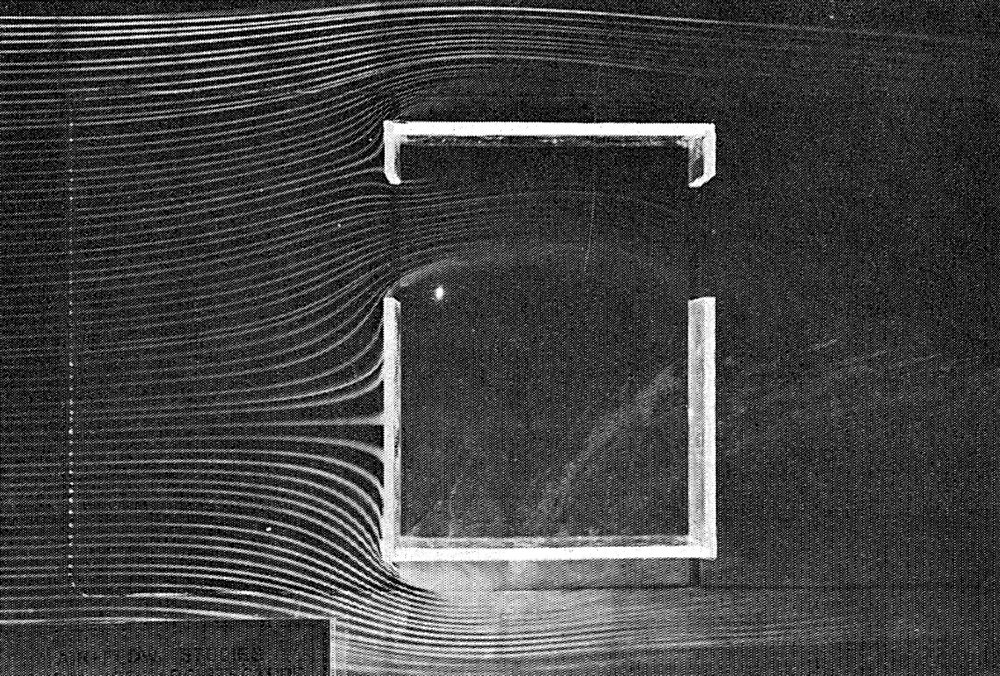
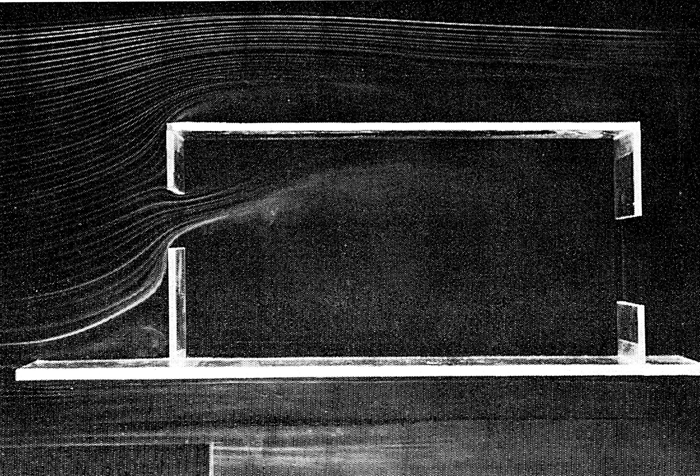
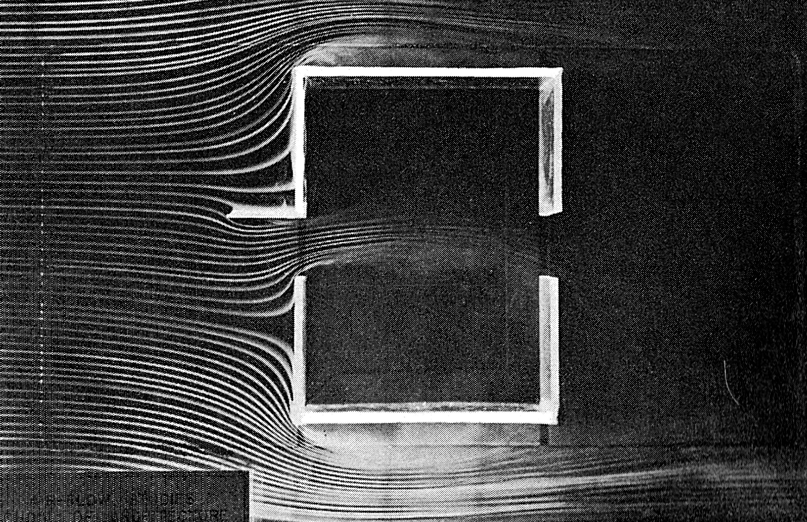

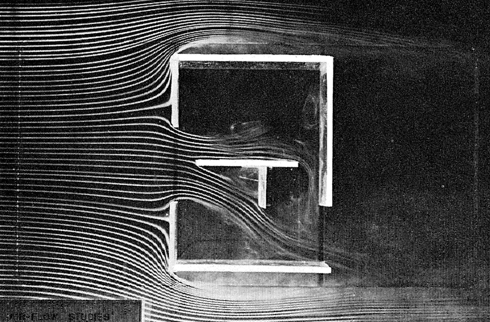

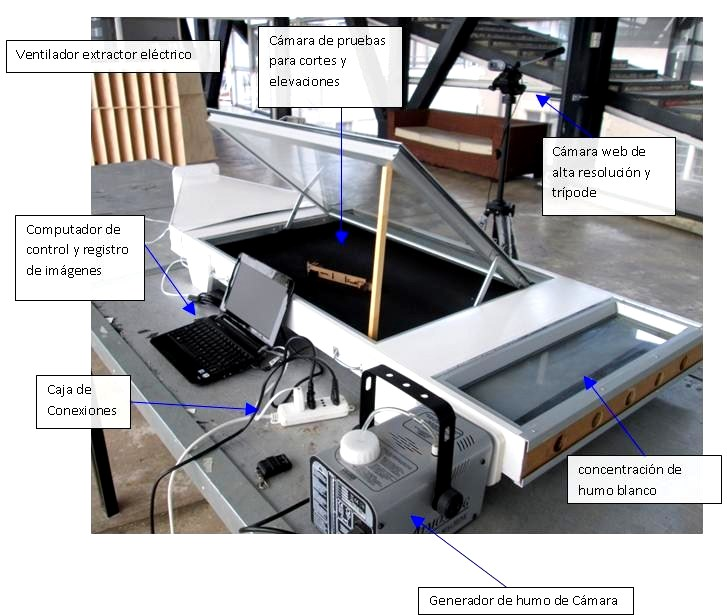

