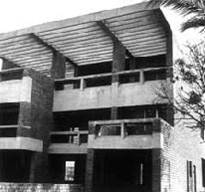
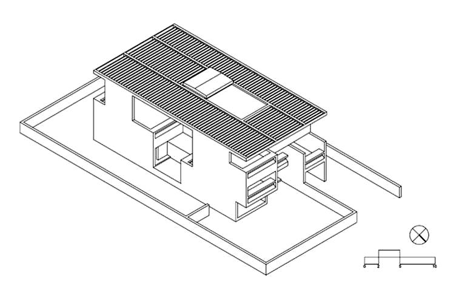
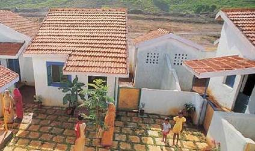
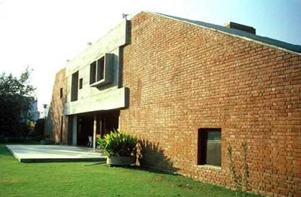

Charles Correa

 
INSTITUTO TECNOLÓGICO Y DE ESTUDIOS SUPERIORES DE MONTERREY 
ESCUELA DE ARQUITECTURA, ARTE Y DISEÑO 

DEPARTAMENTO DE ARQUITECTURA

Diseño Bioclim&aacutetico
Arq. Edmundo José Reyes Guzmán.
Nombre:_______________________________ 
Fecha:________________________________ 
Grupo:________________________________ 

 
CONTENIDO 
PREFACIO 
I. INTRODUCCION.
a) Breve bibliograf&iacutea de Charles Correa y su arquitectura.
b) Abstract del presente trabajo 

II. INDICE
III. VARIANTES BIOCLIMATICAS DE LA ARQUITECTURA DE CHARLES CORREA.

a)Ciudades de la India. Relaci&oacuten clima-arquitectura lograda en c/u de las 6 obras analizadas del Arq. Charles Correa.

b)Distribuci&oacuten espacial y/o tipo de obra arquitect&oacutenica de c/u.

c)Materiales de la regi&oacuten utilizados en los 6 proyectos.

d)Iluminaci&oacuten natural C&oacutemo la utiliza?...

e)Masa t&eacutermica. Su an&aacutelisis en muros y techos. 

f)An&aacutelisis de la ventilaci&oacuten. Qu&eacute principio utiliza, ya sea ventilaci&iacuten cruzada, flujos de ventilaci&iacuten internos y/o Efecto Venturi?... 

g)Protecci&oacuten solar. C&oacutemo utiliza los voladizos, p&eacutergolas, balcones &eacutetc… para obtener sombras en fachadas?... 

h)Enfriamiento directo pasivo. Utiliza doble losa en alguno de sus proyectos?...

i)Por qu&eacute se considera un edificio bioclim&aacutetico y un edificio que utiliza principalmente el enfriamiento pasivo?...
IV. ADECUACIONES BIOCLIMATICAS UTILIZADAS 
V. CONCLUSIONES.

a) Opini&oacuten personal.

b) Bibliograf&iacutea. La cual contendr&aacute el libro del profesor (copias), as&iacute como fuentes web. No wikipedia por favor. 
VI. ANEXOS: 
 
 Incluir el art&iacuteculo: Conferencia Magistral e Charles Correa: "Las bendiciones del cielo". 5 de Marzo de 2001. C&aacutetedra Luis Barrag&aacuten. Transcripci&oacuten de Elo&iacutesa de la Parra Blum.

ENTREGA: Se pide. Documento escrito en Word, NO ENGARGLOADO s&oacutelo grapado. 
 Imprimir solo en hojas recicladas señalando con una tacha en la parte de atr&aacutes la parte que no se utilice.

 

 

M&iacutenimo 6 hojas. M&aacuteximo 10. 
Recomendaci&oacuten: Es necesario hacer con tiempo tu trabajo es tu preparaci&oacuten personal. 
No olvides!... El COPY-PASTE habla p&eacutesimo de tu persona, de tu profesi&oacuten y de tu &oacuteptima preparaci&oacuten para la profesi&oacuten arquitect&oacutenica. 

 

 

Para saber más....

X

 

 
Conoce la obra del arquitecto Charles Correa, consulta el lbro: 
CORREA, Charles, Housing and Urbanization: Building Solutions for People and Cities. Ed. Thames & Hudson. London, 2000. 

