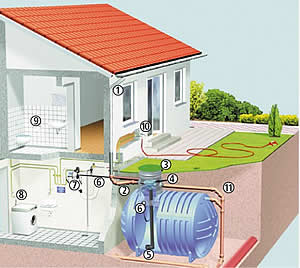
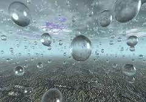
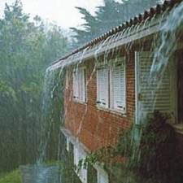
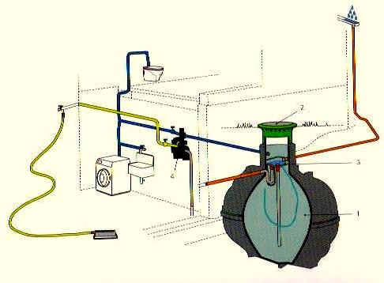

Recolección de agua de lluvia.

 
 
INSTITUTO TECNOL&OacuteGICO Y DE ESTUDIOS SUPERIORES DE MONTERREY 
ESCUELA DE ARQUITECTURA, ARTE Y DISENO 

DEPARTAMENTO DE ARQUITECTURA

 Materias: &nbsp&nbspDise&ntildeo Bioclim&aacutetico ar2017 y Sostenibilidad Ambiental ar2002. 
Arq. Edmundo Jos&eacute Reyes Guzm&eacuten. 

Nombre:_______________________________ 
Fecha:________________________________ 
Grupo:________________________________ 

Tratamiento de aguas pluviales. 

Existen tres opciones diferentes de reciclaje de agua en el hogar. Se pueden reciclar las aguas grises -provenientes de lavabos y duchas, las aguas negras -provenientes de la lavabo y la cocina-, y se puede aprovechar así mismo el agua de lluvia que cae sobre la cubierta de la casa. 

El tratamiento de este tipo de aguas difiere bastante entre sí, aunque lo que tienen en común es que necesitan circuitos hidráulicos separados dentro de la casa. Normalmente plantearse este tipo de instalación es recomendable antes de la construcción de la casa, dada la obra que require la construcción de estos diferentes circuitos.
Muchos se interesan únicamente por un sólo tipo de reciclaje, puesto que el volumen de agua que generarían entre los tres superaría la demanda de agua en los usos que se le da a este recurso. El tratamiento de estas aguas no genera agua potable, cuya consecución sería más compleja; por eso se aprovecha mayormente para limpiezas -suelos, coche, lavadora, etc-, o para regar el jardín. 

 

 

Sistemas de pintura y del sustrato 

Los accesorios de desagüe para techos hechos de chapa de acero prelacada están fabricados de chapa de acero de 0,6 mm galvanizada en caliente, con un revestimiento de zinc de 275 g/m2. Sobre la capa de zinc, cada cara de la chapa está recubierta con una capa de imprimación de 35 µm, seguida por una capa superficial de Prelaq Nova DS. Los soportes de los canalones se fabrican cada vez con mayor frecuencia de chapa de acero prelacada en lugar de las barras de acero antes utilizadas.

1. Canalón
2. Canalón en ángulo (interior, exterior, 45° y 90°) 
3. Tope (izquierdo y derecho)
4. Soporte de canalón (largo, medio , corto) 
5. Pieza de empalme
6. Embocadura 
7. Bajante
8. Tolva
9. Codo, 90°
10. Codo, 75°
11. Abrazadera de bajante para muro de madera
12. Abrazadera de bajante para muro de albañilería
13. Vuelta de pie
14. Desembocadura abatible 
15. Vuelta de pie para alcantarilla
16. Bifurcación 
17. Rejilla para alcantarilla
18. Pieza de conexión
Los sistemas de captación de agua de lluvia no son comunes en los hogares mexicanos y hay poca oferta de equipos para realizar esta actividad.

En general, es más económico ahorrar agua instalando accesorios y equipos ahorradores en el hogar y mejorando los hábitos, que instalar un sistema de recolección de agua de lluvia. 

No obstante, si bien es cierto que aumenta la eficiencia en el uso del agua al instalar equipos ahorradores, cuando dejamos de captar el agua de lluvia desperdiciamos un recurso valioso que podríamos aprovechar.

Los sistemas caseros de recolección de agua de lluvia comúnmente colectan la que cae sobre el techo de la casa y la canalizan a un tanque para usarla en áreas exteriores y en el jardín.
Para utilizarla en estos lugares, simplemente se le pone una llave al tanque, de donde se toma directamente. Para usarla en toda la casa, se requiere de un sistema de distribución con tuberías y una bomba, por lo que esta alternativa es más costosa.

En la práctica, la mayoría de los techos carecen de un área suficientemente grande como para captar suficiente agua de lluvia y satisfacer la demanda en el hogar. Para conocer la capacidad de recolección de tu techo, es necesario calcular el área y la precipitación promedio en la zona en la que vives (herramienta).

Ventajas 
El agua de lluvia puede ayudar a los hogares a ser autosuficientes en zonas en las que no hay conexión a las redes municipales y, así, contribuir al ahorro del vital líquido y disminuir la demanda sobre el suministro público.
Utilizar agua de lluvia en zonas urbanas:

Reduce la necesidad de construir nuevas presas. 
Protege el flujo de los ríos, pues disminuye la necesidad de extraer aguas de fuentes naturales durante la época de lluvias. 
Reduce los costos de operación y mantenimiento de las redes municipales. 

Desventajas

 Los sistemas de recolección de agua de lluvia son costosos y en México, por las bajas tarifas que tiene el agua potable, es difícil recuperar la inversión en un corto plazo. Algunas de las desventajas más importantes son:
Estos sistemas requieren de mucho mantenimiento. Hay que conservar limpio el techo y los canales. La falta de mantenimiento de los sistemas genera riesgos sanitarios. 
La temporada de lluvias normalmente se limita a unos meses, por lo que se necesita otra fuente de agua para el resto del año, a menos de que se tenga gran capacidad de captura y almacenamiento. 
 En general, el agua de lluvia, especialmente en zonas urbanas, no es potable sin un tratamiento previo y carece de la calidad suficiente para el consumo humano. 
Se necesita espacio suficiente para el tanque. Para uso doméstico, el tamaño de éste va desde 400 litros cuando el agua se va a usar solamente en el jardín, hasta 5,000 litros si se va a utilizar en toda la casa durante la época de lluvias. 
Para ser autosuficientes sólo con agua de lluvia durante todo el año, se necesitan tanques con capacidades desde 50,000 hasta 100,000 litros y esto sólo es viable si se cuenta con un área suficiente de techo para colectar esta cantidad. 

Mantenimiento 
El mantenimiento regular es muy importante para asegurar que el agua de lluvia tenga buena calidad para su uso en el hogar.
Un riesgo grande de contaminación del tanque viene de los excrementos de aves y otros animales.
Otro problema potencial es la presencia de contaminantes en el techo y en el aire que podrían disolverse en el agua.
Para evitar algunos de estos problemas, se deben llevar a cabo las siguientes actividades:

Revisar, cuando menos semanalmente, el techo y los canales para quitar basura, hojas etc. 
Evitar que haya vegetación que cuelgue arriba del techo, como ocurre con árboles grandes. 
Drenar el tanque, al menos cada dos años, para remover el sedimento. 
Evitar almacenar las primeras lluvias, pues éstas son las más cargadas de contaminantes provenientes del aire. 
 

Se pide a continuaci&oacuten responder a las siguientes preguntas: 

1.¿Cuáles son las partes en que consta un sistema de recolección de agua pluvial?.. 
2.¿Para que sería necesario calcular el área de recolección del techo y la precipitación promedio en la zona en estudio?...
3.Para uso doméstico, ¿Cuál sería una capacidad recomendable del tanque de almacenamiento?... ¿Sera igual para el jardín y/o para la casa?..
4.En Monterrey.. ¿Sería recomendable el hacer un sistema de captación de agua de lluvia?..
5.¿Cuáles serían algunas recomendaciones para su mantenimiento?...

 

