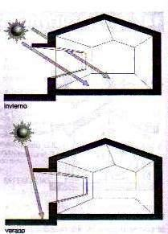
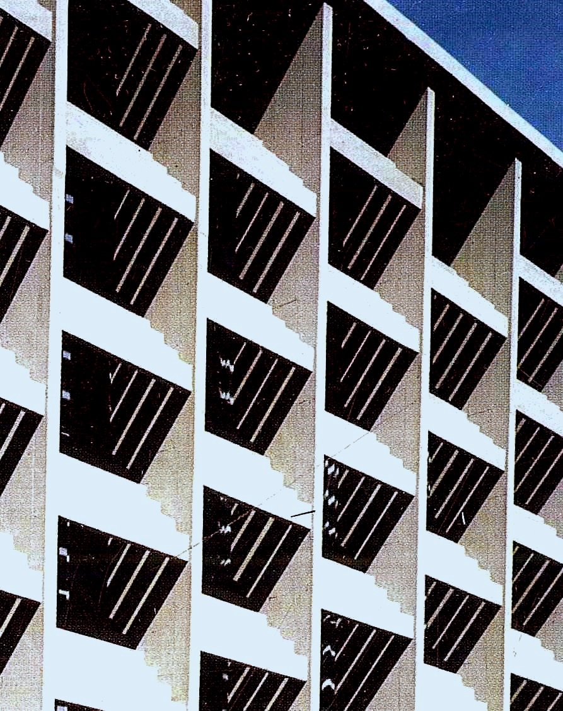
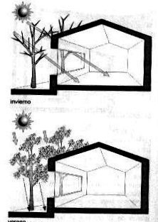
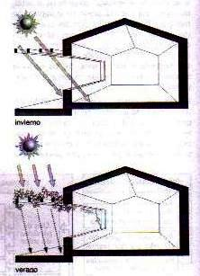

 Protección solar y diseño de aleros   INSTITUTO TECNOLÓGICO Y DE ESTUDIOS SUPERIORES DE MONTERREY ESCUELA DE ARQUITECTURA, ARTE Y DISE&NtildeO DEPARTAMENTO DE ARQUITECTURA. Dise&ntildeo Bioclim&aacutetico / Sostenibilidad Ambiental. Nombre:_______________________________ Fecha:________________________________ Grupo:________________________________ Las protecciones solares más comunes pueden ser: Son dispositivos arquitectónicos diseñados para brindar protección a las aberturas o fachadas. Las protecciones pueden ser: verticales, horizontales o mixtas. Sus características y dimensiones dependerán de la orientación o el tamaño de la ventana. Parasoles fijos. Son dispositivos arquitectónicos diseñados para brindar protección a las aberturas o fachadas. Las protecciones pueden ser: verticales, horizontales o mixtas. Sus características y dimensiones dependerán de la orientación o el tamaño de la ventana. Elementos móviles Su accionamiento permite el ajuste a la posición del sol a lo largo del día, regulando la exclusión o ingreso de radiación solar. Estos elementos pueden ser exteriores, tales como: celosías, lamas regulables, toldos etc. O interiores como las cortinas y persianas. Hay que tener en cuenta que la protección exterior es más aconsejable, ya que impide que la radiación solar atraviese el vidrio y genere un efecto invernadero Espacios de sombra adosados Son espacios adosados a la edificación, con elementos que impiden la incidencia de la radiación solar directa con aberturas y muros exteriores. Estos espacios pueden ser galerías o pérgolas, siendo conveniente en este último caso utilizar enredaderas o de hojas caducas. Protección con vegetación En algunos casos se pueden utilizar especies vegetales para la protección de las aberturas y muros tales como árboles, cortinas vegetales o trepadoras, pero en todos los casos es conveniente que las mismas sean de hojas caducas para permitir el soleamiento en el invierno, cuando se produce la pérdida del follaje y evitar la incidencia de radiación en el verano, época en que la especie vegetal se cubre de hojas.   Comportamiento de un parasol fijo horizontal orientado al norte. Fernando Moreno Barberá. Universidad de Valencia, España.  Protección solar por vegetación.  Protecciones solares por espacios de sombra adosados al edificio.     Las protecciones solares son excelentes recursos arquitectónicos para protegerse de las inclemencias del tiempo, pero sobre todo del soleamiento que existe en las fachadas actuales. las cuales están diseñadas para "consumir grandes cantidades de aire acondicionado" e ignorar las posibilidades de los sistemas pasivos de protección solar. ACTIVIDAD: Investiga en revistas de arquitectura actuales, libros y/o en internet: 5 arquitectos que utilicen dispositivos de control solar y/o protecciones solares en sus obras. No olvides que es necesario citar tus fuentes bibliográficas. Nota: Es pertinente que cada alumno consulte sus propios ejemplos.   ÉXITO EN TUS TAREAS!...   

