Elementos exteriores 

INSTITUTO TECNOLOGICO Y DE ESTUDIOS SUPERIORES DE MONTERREY 
ESCUELA DE ARQUITECTURA, ARTE Y DISE&NtildeO 

DEPARTAMENTO DE ARQUITECTUA.

Dise&ntildeo Bioclim&aacutetico / Sostenibilidad Ambiental.
Nombre:_______________________________ 
Fecha:________________________________ 
Grupo:________________________________ 

Protecciones interiores (click!..) 

TIPOS DE ELEMENTOS EXTERIORES DE SOMBREAMIENTO INCORPORABLES EN EL DISEÑO DE LA EDIFICACIÓN: 

   

Tipo

Características

Orientación Adecuada

Voladizo Macizo.

El aire caliente queda retenido en el área de la ventana.
Disminuye la iluminación directa.

Sur

Lamas fijas paralelas a fachada

 Permiten la circulación vertical del aire y limitan la retención de aire caliente en el sistema de ventana

Sur

Lamas fijas perpendicualares a fachada

Permiten la circulación vertical del aire caliente. 
Impiden el acceso a rayos de sol laterales. 
Permiten el acceso a rayos solares perpendiculares a fachada.

Suroeste 
Sureste 

Lamas horizontales fijas en plano vertical

Adecuadas para orientaciones en que la trayectoria del sol sea muy baja.
Su eficiencia resulta mayor cuando se combinan con elementos de voladizo horizontales.

Este 
Oeste

Protección sólida en plano vertical

Adecuadas para orientaciones en que la trayectoria del sol sea muy baja.
Disminuye la iluminación directa.

Este 
Oeste

lamas horizontales regulables en plano verticla

Adecuadas para orientaciones en que la trayectoria del sol sea muy baja. 
Permiten regular la iluminación natural. 
Implican sistema de regulación continuo.

Este 
Oeste

Lamas verticales fijas en plano perpendicular a fachada

Adecuadas para orientaciones en que la trayectoria del sol sea muy baja.
Crea zonas críticas de sombra total.

Este 
Oeste

Lamas verticales fijas en plano inclinado con fachada

Adecuadas para orientaciones en que la trayectoria del sol sea muy baja.
Crean zonas criticas de sombras desiguales. 

Este 
Oeste

Lamas verticales regulables

Adecuadas para orientaciones en las que la trayectoria solar sea muy baja. 
Permiten regular la iluminación natural, pero implican un sistema de regulación continuo. 

Este 
Oeste

 

Los elementos de control solar son horizontales o verticales, pueden ser fijos o regulables. 

Los sistemas regulables, tales como toldos y elementos con estructura de lamas orientables permiten optimizar el control en función del recorrido solar. 
Por otro lado, los elementos de pantalla a la radiación solar directa no deben impedir la ventilación de las ventanas, sino más bien permitir el movimiento vertical del aire caliente para facilitar su eliminación y potenciar la reducción de la temperatura superficial de los elementos de fachada exteriores expuestos a la radiación solar. 
La obstrucción parcial o total de la radiación solar adquiere una importancia variable en función de las orientaciones y periodos de incidencia solar. Los dispositivos fijos horizontales son recomendables, debido al ángulo de incidencia solar, en la orientación Sur (Hemisferio Norte). Las fachadas Este y Oeste, debido al bajo ángulo de incidencia solar, son menos susceptibles de ser sometidas a métodos de control directo horizontales, siendo preferibles mecanismos de control verticales regulables. 
El uso apropiado de protectores solares es muy importante, especialmente en los edificios que utilizan aire acondicionado. El sombrear apropiadamente reduce lo que es esencialmente un gasto no necesario de energía intentando enfriar un espacio con grandes áreas de ventanas no protegidas. A continuación se muestran diagramas de las diferentes maneras de protegerse del sol.

Al momento de diseñar un edificio es muy importante tomar en cuenta la ubicación de éste. Las áreas donde tenga menos circulación deben de estar en las fachadas que dan al Oriente y al Poniente. Las de más circulación o de mayor importancia deben de estar ubicadas ya sea hacia el Norte o hacia el Sur. 
La ventaja que tienen las fachadas orientadas hacia el Norte es la iluminación natural sin necesidad de protegerse del sol.
El sol sale del Oriente (Este) y entra por el Poniente (Oeste).
En el caso de nuestro país es necesario proteger el edificio durante el verano y dejar que entren los rayos solares durante el invierno.
 Como se muestra en el dibujo de arriba el sol de verano está casi a 90° y el de invierno a 45°.

Tips de protección solar:

Las fachadas Oriente y Poniente se deben de proteger con elementos verticales.
La fachada Sur se debe de proteger con elementos horizontales 

Para poder diseñar un alero se necesitan los siguientes datos del lugar donde se desea construir:

Longitud 
Latitud
Hora a la se desea proteger de los rayos solares
Hora a la se desea que penetren los rayos solares
Fecha a la se desea proteger de los rayos solares
Fecha a la se desea que penetren los rayos solares 

Una vez que los datos san obtenidos, posteriormente, consulta la página: 
squ1.com
Susdesign.com
y registran estos datos para saber de qué longitud debe ser el alero. 

 Protecciones Interiores   

Entre ellas tenemos las persianas tipo venecianas, cortinas de enrollar, visillos etc. Se debe tener en cuenta que todos los elementos interiores transmiten una gran proporción de la energía que reciben por lo que es conveniente, principalmente en climas cálidos, utilizarlos en combinación con elementos exteriores de protección para evitar el efecto invernadero. 
Las protecciones externas resultan altamente superiores respecto a las internas, puesto que bloquean la radiación solar antes de que esta atraviese la ventana. Las protecciones internas, en cambio, detienen la radiación solar, pero absorben calor que luego es disipado al interior del local por convección y radiación de onda larga. La eficiencia de este tipo de protecciones dependerá básicamente de su capacidad para reflejar la radiación. 

Se debe tener cuidado con el uso de protecciones externas con superficies reflejantes y que a su vez reflejen hacia el interior parte de la radiación.
Se debe tener cuidado con el uso de protecciones externas con superficies reflejantes y que a su vez reflejen hacia el interior parte de la radiación que reciben o que puedan ocasionar problemas de deslumbramiento. 

En esta clasificación la variedad es más amplia e incluye: 

Elementos móviles: persianas, celosías y toldos. 
Espacios de sombra adosados: pérgolas y terrazas techadas.
 Parasoles: horizontales, verticales y mixtos.
 

Elementos móviles: 
Las protecciones móviles son todas aquellas diseñadas para ajustarse a las condiciones climáticas y de posición solar a lo largo del día y para permitir o excluir la entrada de sol. 
Ésta regulación puede ser manual o mecánica, en el primer caso el ocupante del edificio deberá encargarse d ajustar periódicamente las protecciones a fin de permitir o excluir la radiación solar, y éste es el caso de los parasoles móviles, celosías, cortinas de enrollar, postigos, toldos, etc.
La regulación mecánica puede realizarse por medio de motores accionados en forma manual o automática, o bien tener una regulación dependiente de la misma situación solar. 
El principal problema de los sistemas de protecciones móviles es que condicionan su eficiencia a que el ocupante del edificio este efectivamente atento a su regulación y mantenimiento, además que al tratarse de elementos móviles su costo es más alto al requerir mecanismos de accionamiento y procedimientos constructivos más complejos. 
 Toldos y persianas móviles.

PREGUNTAS: 

1.- En una residencia, cuya fachada principal está orientada al sur.. 
¿Cuáles serían las protecciones ideales para las ventanas que están orientadas al este, oeste y sur, conociendo las orientaciones ideales?..
Realiza un boceto indicando tu propuesta de aleros.
2.- Explica.. ¿Cuáles serían las recomendaciones ideales para poder emplear una protecciòn sólida en plano vertical en un edificio de oficinas. 
3.- ¿Porqué se proponern las lamas fijas perpendiculares en fachada para orientaciones suroeste y sureste?... 
4.- ¿Cuál sería la orientación ideal para un Parasol mixto en caja?..
5.- Explica la función de los páneles plegadizos y cortinas interiores aislantes.
6.- Explica y ejemplifica, la función de los elementos móviles.
7.- ¿Cuál sería una desventaja de los protectores móviles?..

Efectúa una investigación en internet y/o cita un libro consultado, en donde se manejen: 

8.- Lamas horizontales regulables. 
9.- Voladizo macizo.
10.- Lamas verticales fijas en plano inclinado con fachada. 
 Nota: La copia es motivo de cancelación de la actividad. 

 
ÉXITO EN TUS TAREAS!...

 

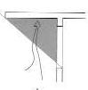
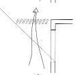
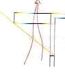
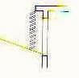
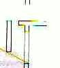
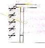
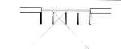
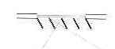
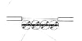
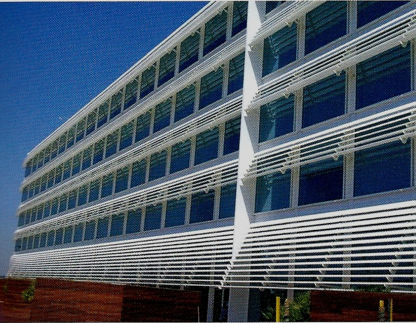
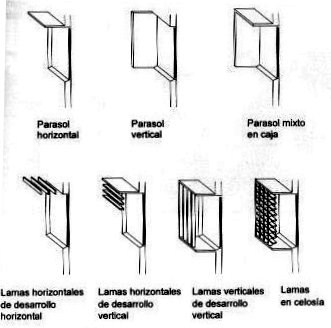

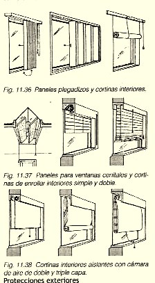
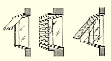
