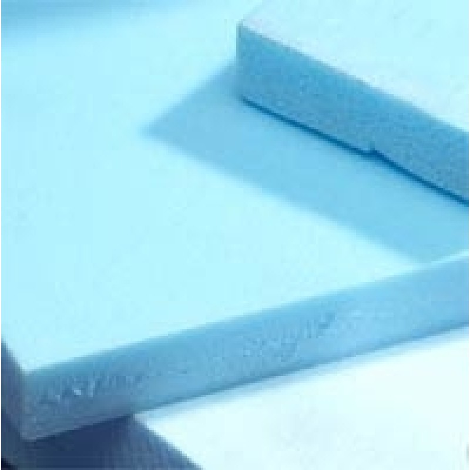
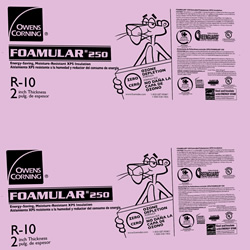
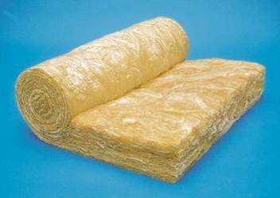
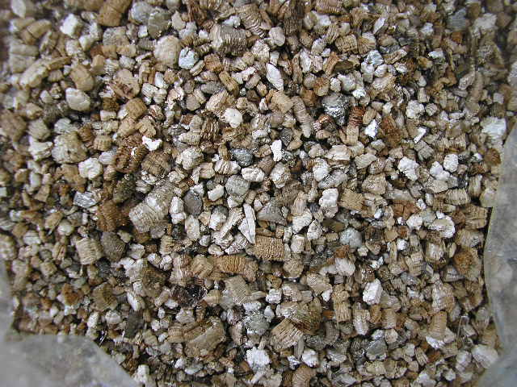
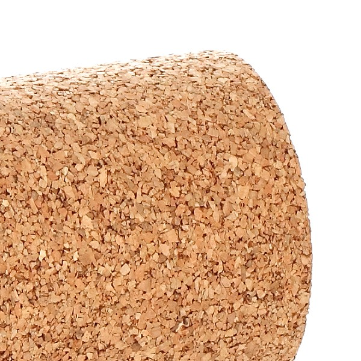
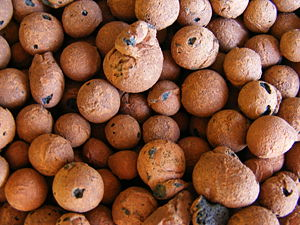

Materiales aislantes

 
 
INSTITUTO TECNOLÓGICO Y DE ESTUDIOS 
 SUPERIORES DE MONTERREY
ESCUELA DE ARQUITECTURA, ARTE Y 
 DISEÑO
DEPARTAMENTO DE 
 ARQUITECTURA
Arq. Edmundo J. Reyes 
 Guzmán.
SUSTENTABILIDAD AMBIENTAL/ DISEÑO BIOCLIMÁTICO.
 Materiales aislantes: 
Los Materiales Aislantes se usan en la construcción para la protección de la obra arquitectónica, de sus envolventes; logrando así, disminuir los peligros de incendio. Los efectos del calor y del frío, los ruidos inevitables y evitar la humedad. Con ello se busca lograr el Confort Humano.
Debemos recordar que todos los materiales presentan algún comportamiento específico ante el calor, el agua, el fuego ó el ruido.

Aislante térmico: 

Aquel material que tiene la propiedad de impedir la transmisión del calor y que se caracteriza por su Resistividad Térmica. Su poder radica en su baja densidad, por tener celdillas con aire seco. Si dichas celdillas entran en contacto con el agua o la humedad, pierden su propiedad aislante, ya que en ese caso pasan a ser más pesados, densos y conductores.

 Funciones: 
 Economizar energía
 Reducir la pérdida en las envolventes.
 Mejorar el confort térmico.
 Aumentar la resistencia térmica en la envolventes.

 Características: 
Porosos (celdas con aire o algún gas seco encapsulado en su interior, en estado inerte o quieto). 
Posee baja capacidad de conductividad.
Alta Reflectividad.
Impermeable al vapor de agua.
Ejemplos 
Corcho aglomerado. 

Espuma de Poliuretano.

Poliestireno expandido.

Lana de vidrio.

Vermiculita.

Arcilla expandida.

Piedra pomes o escoria de lava volcánica.

Fibras vegetales de madera, de eucalipto, aglomerado, fibras de caña, de paja, de amianto, etc

 

 
1. Los materiales aislantes se usan en construcción para la protección de la vivienda contra la humedad, para disminuir los peligros de incendio y hacerla más confortable disminuyendo los efectos del calor y del frío, para disminuir los ruidos inevitables producidos por las máquinas en ciertas fábricas y oficinas, y contribuir también al mayor rendimiento de las instalaciones de calefacción, hornos y cámaras frigoríficas al impedir o disminuir grandemente la pérdida de calor o frío, según el caso, por radiación. Las funciones de estos materiales son, pues, hidrófugas, antitérmicas, antisónicas e ignífugas.

2. Los materiales aislantes dependen de su naturaleza y de una cualidad común a todos ellos: la porosidad. Esta depende de los espacios vacíos de los cuerpos.

3. El coeficiente de porosidad se determina por Va - Vr = e, donde Va es el volumen aparente, Vr el volumen real y e los espacios vacíos; luego, la porosidad:

lo que constituye el llamado coeficiente de porosidad.

A continuación se observa una tabla de coeficientes de porosidad de los materiales usuales en construcción, en orden decreciente. 

Ladrillos huecos......................................... 45%

Ladrillos comunes de media cal................... 45%

Mortero de cemento 1:3............................. 38%

Ladrillos comunes de cal............................ 36%

Revoque grueso........................................ 33%

Ladrillos de máquina.................................. 32.7%

Tejas comunes.......................................... 29%

Maderas blandas....................................... 25%

Pizarra...................................................... 10%

Mármoles.................................................. 2.3 a 4.5%

Granitos.................................................... 0.6 a 4%

Baldosas de cemento................................. 0.46%

4. Porosidad: es la propiedad que tienen los cuerpos de dejarse atravesar por aire, agua, calor, sonido y hasta por los microorganismos.

a) La permeabilidad al aire,está en razón directa al tamaño de los poros y no a su volumen total. La permeabilidad de un muro puede aumentarse con la presión que el aire ejerza sobre su superficie, debido a la diferencia de temperaturas entre ambos paramentos. Esta presión puede obtenerse con la fórmula de Long:

donde V es el volumen del aire que se infiltra por la pared en metros cúbicos por hora, F la superficie del muro en metros cuadrados, e el espesor del muro en metros y p = p'- p'' diferencia entre presiones del aire sobre ambos paramentos, debido a la diferencia de temperaturas. El coeficiente de permeabilidad c al aire, vale para el ladrillo 0.000201, para la mampostería 0.000124 y para el hormigón 0.000258.

b) La permeabilidad al agua, es como la anterior, pero en menor grado debido a que algunos materiales permeables al agua no lo son al agua, o lo son en muy pequeña proporción. Esta proporción está basada en los tamaños de los poros y en la capilaridad.

c) La permeabilidad al calor, es la propiedad que tienen algunos materiales de transmitir la temperatura de una superficie a la otra, es decir, la que recibe de un lado y la irradia por el opuesto. 

5. La cantidad de calor que pasa, por metro cuadrado, por hora y por grado de diferencia entre ambas temperaturas, se llama coeficiente de conductibilidad, que se obtiene por la fórmula general

Donde W es la cantidad de calor que transmite en calorías hora, F es el área de dicha superficie, (t - t1) es la diferencia entre las temperaturas internas y externas, e es la distancia entre t y t1, o sea el espesor del material, K el coeficiente de conductibilidad, que es variable según la naturaleza del material, y 1 / K es la resistencia.

El coeficiente de conductibilidad está relacionado con la propiedad de permeabilidad al calor.
 
Otros: 
Foamular: "Pink panter". 
 
Es un aislamiento térmico de espuma rígida de poliestireno extruido en paneles.

Tiene una superficie lisa y una estructura de celdas cerradas con paredes que se ínter adhieren unas con otras sin dejar vacíos, formada, de celda cerrada, de cloruro de polivinilo (PVC), con adhesivo a un lado, controla la transmisión de sonido y vibraciones.

Se usa principalmente en sistemas de techos de concreto y metálicos, con sistemas de impermeabilización o debajo de acabados, por ejemplo tejas de barro.
También con sistemas de cubiertas metálicas compuestas.

Styrofoam 
El aislamiento de células cerradas espuma de poliestireno extruido ayuda a reducir la pérdida o ganancia de calor conservando altos valores de factor R (resistencia transferencia de calor) y las características del shiplap bordes para garantizar un ajuste perfecto y seguro.

Sus usos principales son como aislamiento térmico en cubiertas y fachadas sin cámara (aislado por el interior) como:
Naves industriales, centros comerciales, almacenes,frigoríficos, granjas.
Es aplicado en losas metàlicas, compuestas,sencillas y de concreto.

Fibra de Vidrio (MBI)
Rollo flexible de aislamiento térmico, fabricado con fibras de vidrio aglutinadas con resinas termo fijas recubierta con una barrera de vapor (vinil satinado o polipropileno reforzado) en una de sus caras.
Es resilente (recupera su espesor original).
No absorbe humedad.
Es incombustible.
No favorece la corrosión.
Mayor reflexión de la luz.
Alta eficiencia acústica.
Dimensionalmente estable.
Es inorgánico

PREGUNTAS:
1.- ¿Para qué se utilizan en una construcción los materiales aislantes?...

2.- Un material aislante... se utiliza únicamente para "aislar y protejer del calor a la construcción".. o existe algún otro uso?...

3.- ¿Qué es un aislante térmico?...

4.- ¿Porqué un material aislante debe de ser "poroso"?...

5.- ¿De dónde se obtiene la Vermiculita?...

6.- ¿Cuál es la función del índice de coeficiente de porosidad?.... 
7.- ¿Cuál material tiene el mayor índice de coeficiente de porosidad?... 
8.- ¿Cuál material tiene el menor índice de coeficiente de porosidad?...
9.- Define la permeabilidad del agua, del aire y del calor.. ¿Cuáles son sus diferencias?...

10.- ¿Qué ventajas tiene el foamular "pink panter"?.. ¿Qué desvenajas tiene?...

11.- ¿Para qué sirve el styrofoam?.. 

12.- ¿Es mejor el foamular y/o el styrofoam?...
13.- ¿El material aislante se coloca por dentro o por fuera de la construcción?...
14.- Realiza un detalle constructivo de un MURO, en dónde se pueda apreciar el material aislante señalando el nombre de cada material?..
15.- Investiga y menciona en inernet al menos 5 materiales de cubierta utilizados para impermeabilizar.

 

 La copia de las tareas (actividades) es una vergüenza!.. Évitala por favor!...

Sabías que... 

X

 

Las fibras de vidrio aglutinadas poseen resinas termo fijas con una barrera de vapor (vinil satinado ò polipropileno reforzado) en una de sus caras dando más vida útil al aislamiento. 

