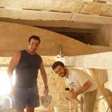
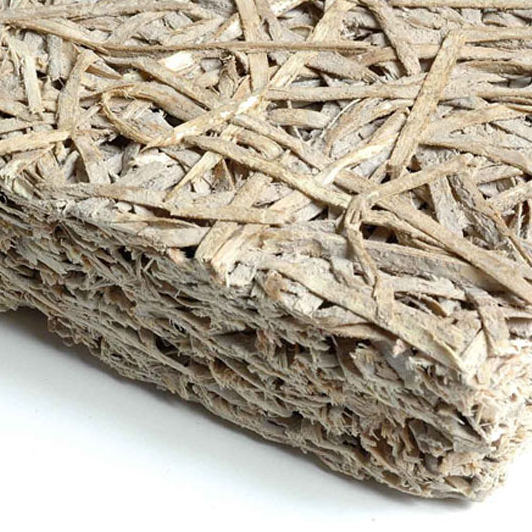
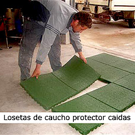
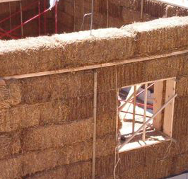
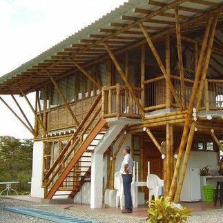
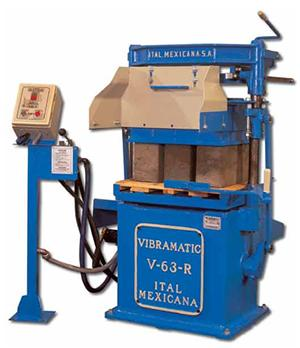

Materiales Ecológicos

 

 
INSTITUTO TECNOLOGICO Y DE ESTUDIOS SUPERIORES DE MONTERREY 
ESCUELA DE ARQUITECTURA, ARTE Y DISE&NtildeO 
DEPARTAMENTO DE ARQUITECTURA.

Dise&ntildeo Bioclim&aacutetico / Sostenibilidad Ambiental.
Nombre:_______________________________ 
Fecha:________________________________ 
Grupo:________________________________ 
Podemos considerar Materiales de Construcción Sostenibles a aquellos que sean duraderos y que necesiten un escaso mantenimiento, que puedan reutilizarse, reciclarse o recuperarse.
No se puede negar la importancia de los Materiales de Construcción Sostenibles al momento de idear un modelo de construcción sustentable. El 40% de los materiales utilizados son destinados a la construcción y mantenimiento de edificios.
Hemos pasado por cambios fundamentales en el desarrollo de la obtención de los materiales, ya que tiempo atrás las poblaciones rurales los conseguían en las proximidades con un bajo impacto sobre el territorio. Luego, con medios de extracción y elaboración más poderosos y eficaces, y medios de transporte más accesibles, la producción de materiales devino en una actividad de alto impacto.
A diferencia del planeamiento, el diseño y la construcción de los edificios, que se circunscribe a un grupo de técnicos, el tema de los materiales está más al alcance de cualquier persona (reformas, mantenimiento, etc.) 

Algunos de los más comunes son: 
 
Adobe:
Piedra natural:
Paja:
Madera:
Bambú:
Ladrillo:
Pared vegetal:
Otros: 

Los materiales sustentables y el medio ambiente. 
Hay 5 puntos en los que podemos focalizar el impacto que causan los materiales sobre la salud y el medio ambiente:
1.- Consumo de energía
Utilizar materiales de bajo consumo energético en todo su ciclo vital, será uno de los mejores indicadores de sostenibilidad. Los materiales pétreos como la tierra, la grava o la arena, y otros como la madera, presentan el mejor comportamiento energético, y los plásticos y los metales -sobre todo el aluminio- el más negativo.
Los plásticos y los metales consumen mucha energía en el proceso de fabricación; sin embargo, los plásticos son muy aislantes y los metales, muy resistentes.
2.- Consumo de recursos naturales
El consumo a gran escala de ciertos materiales puede llevar a su desaparición. Sería una opción interesante el uso de materiales que provengan de recursos renovables y abundantes, como la madera.
3.- Impacto sobre los ecosistemas
El uso de materiales cuyos recursos no provengan de ecosistemas sensibles, es otro punto a tener en cuenta. Como la bauxita que proviene de las selvas tropicales para fabricar el aluminio o las maderas tropicales sin garantías de su origen.
4.- Emisiones que generan
La capa de ozono se redujo, entre otras razones, por la emisión de los clorofluorocarbonos (CFC)
El PVC, defensor en la causa en la industria del cloro, debido a sus emisiones de furanos y dioxinas, tan contaminantes, van siendo prohibidos en cada vez más usos, como el suministro de agua para consumo humano.
5.- Comportamiento como residuo
Al concluir su vida útil, los materiales pueden causar graves problemas ambientales. El impacto será menor o mayor según su destino (reciclaje, incineración, reutilización directa)
El uso posterior de vigas de madera, antiguas tejas cerámicas o material metálico para chatarra es muy apreciable.

Pautas para una Selección de Materiales Sostenibles 

Que tengan larga duración
Que puedan ajustarse a un determinado modelo
Que provengan de una justa producción
Que tengan un precio accesible
Que sean valorizables
Que sean no contaminantes
Que consuman poca energía en su ciclo de vida
Que en su entorno tengan valor cultural
Que provengan de fuentes abundantes y renovables
Que posean un porcentaje de material reciclado.
Que no utilicen materiales de aislamiento que contenga CFC. 

  
 

  

  
 

  

  

  
 

 

Ciclo de vida de los materiales 
Extracción: Consideración por la transformación del medio.
Producción: Plástico y Metal: Emisiones generales y consumo energético. 
Transporte: Consumo de energía (más alto cuanto de más lejos provenga el material) y emisión de gases. 
Puesta en obra: Riesgos sobre la salud de la población y generación de residuos. 
Deconstrucción: Emisiones contaminantes y transformación del medio, residuos. 
Adobe:   
El adobe está formado por una masa de barro (arcilla, arena y agua) mezclada a veces con paja, fibra de coco o incluso estiércol, moldeada en forma de ladrillo y secada al sol durante unos días. 
La mezcla principal lleva un 20% de arcilla y in 80% de arena y agua. Es un buen aislante acústico y tiene una gran inercia térmica, por lo que sirve de regualdor de temperatura interna; en verano conserva el frescor y durante el invierno, el calor. 
La inclusión de fibras vegetales puede atraer a las termitas. 
Si está bien ejecutada y el mantenimiento es bueno, una construcción de adobe puede durar unos cien años o más. Para aplicaciones exteriores está recomendado para países de pluviometría escasa. 
Una alternativa del adobe es la tapia, que es una gran pieza grande compactado a golpes dentro de un molde de madera que se usa para hacer muros. El molde para hacer las tapias, formado por dos tableros paralelos a cierta distancia entre ellos, es el tapial . 
Otra alternativa es el adobe estabilizado efectuado con una máquina adobera ya sea manual o mecánica el cual puede ser fabricado en serie. No olvidar que es necesario conocer el tipo de suelo necesario para que el adobe puede ser utilizado, el cual debe se en parte limoarenoso y humedo. 

Las estructuras de adobe son generalmente autoconstruídas, porque la técnica constructiva tradicional es simple y no requiere consumo adicional de energía.
Los bloques se adhieren entre sí con barro para levantar los muros de fachada o particiones interiores de una vivienda. Es usual en regiones semidesérticas de África, América Central y del sur. 

Piedra natural:   
La piedra es el material de construcción noble por excelencia. Como material estructural las más utilizadas son la arenisa, la caliza, la cuarcita, la laja y la pizarra. Son usadas en cimentaciones,paredes, fachadas y como elemento arquitectónico. La piedra porosa es menos durable que la piedra dura. 
La piedra es el material con mayor inercia térmica, y eso ahorra tremendos costes en energía para climatización. Ocupa espacio, si, y más si la usas como material estructural (que no parece el caso) pero teniendo en cuenta que esta casa está en el campo, el espacio no parece un problema. Por otra parte los gaviones rellenos de piedra, alineados y estibados se utilizan para estabilizar taludes. Pero su diversidad de uso se ha ampliado, multiplicando sus aplicaciones por la alta durabilidad del material (alambre de acero con galvanizado especial), por el modo de montaje rápido y estable y por formas y acabados especiales.

Paja:   
La paja es un material de construcción de baja energía incorporada y seguramente es el más ecológico que pueda utilizarse en una vivienda. 
Hay dos sistemas principales de construcción con paja: el estilo Nebraska, en el que la paja actúa como muro de carga, y el estilo poste y vigas, en el que un sistema de postes o columnas soporta el pedo del tejado. También hay la posibilidad de realizar un híbrido entre ambos estilos. 

Para los muros con pacas estructurales, (bloques de paja) sólo se puede contruir un nivel y el área máxima de aberturas no debe exceder 50% del total del área del muro. No requiere una estructura para soportar el techo y su diseño es sencillo, lo que representa un ahorro en tiempo, materiales y labor de construcción.
 Sin embargo, al no contar con estructura de soporte, el techo debe ser ligero. 
Madera:   
El problema reside en saber bien de ¿Dónde proviene y como ha sido explotada la madera?.. Algo que es difícil de conocer si no hay certificados ecológicos de por medio. 
Los bosques son de vital importancia, no solo como sumideros de CO2, sino para controlar la erosión, favorecer la infiltración de agua en el suelo o regular las precipitaciones. 
La durabilidad de una estructura de madera depende de la especie empleada y del mantenimiento. 
odo el mundo sabe que la madera es al material de construcción más natural y ecológico posible, y que sus cualidades como aislante térmico y acústico son insuperables. Sin embargo, existe la confusión de que la madera sólo aísla del frío y, por lo tanto, no interesa tanto en los climas cálidos. Esto no tiene ninguna base real, los materiales aislantes simplemente mantienen una diferencia de temperatura entre el interior y el exterior, sin distinguir si el interior debe mantenerse cálido mientras el exterior está frío o, por el contrario, el interior debe mantenerse fresco mientras el exterior está caliente. 

Actualmente el sello promovido por el FOREST STEWARDSHIP COUNCIL (FSC), una organización internacional aparecida en el Reino Unido a principios de los años 90, es una de las certificaciones más fiables para asegurarse que la madera proviene de explotaciones sostenibles .
Bambú:   
El Bambú es una gramínea leñosa que se renueva naturalmente cada siete años y que no necesita de la utilización de los plaguicidas ni fertilizantes si se cultiva de manera adecuada. Según la especie puede crecer entre 7.5 y 40cm diarios, y alcanzar los 40m. Se aplica (con las debidas excepciones y tipo de construcción) en columnas, cubiertas, techos, muros o revestimientos. Si se usa para la estructura se necesita su máxima resistencia (cuanto más obscuro sea el bambú más blando es) y elasticidad. 
 En America Latina y en Asia se utiliza la caña entrelazada mediante estructura de nudos. 
Se debe de trabajar también con Bambú certificado por el FSC. 
Ladrillo:    
 Un ladrillo es una muestra de cerámica compuesta por arcilla o por una mezcla de ella, moldeada en bloques que adquieren dureza mediante su secado al sol o cocción. Se emplea en albañilería para la ejecucción de fábricas de ladrillo, ya sea para muros, tabiques y fachadas. 
A diferencia del adobe, que también contiene arcilla, el ladrillo es un producto más procesado, lo que explica su mayor energía incorporada en su elaboración 6 veces superior a la del adobe. 
Su cocción industrial se realiza en hornos de túnel, donde la temperatura oscial entre 900ºC y 1000ºC. 
Por dicho motivo, y aunque parte de su composición sea natural, el ladrillo también tiene una vertiente menso ecológica. Los muros de ladrillo tienen una elevada inercia térmica. 

La Termoarcilla es un bloque cerámico de baja densidad. Partiendo de una mezcla de arcilla, con aditivos aligerantes que se gasifican durante el proceso de cocción a más 900ºC sin dejar residuos, se origina una fina porosidad homogenéneamente repartida en la masa de cerámica del bloque. 

Pared vegetal:   

La pared vegetal no se puede considerar un elemento estructural de la vivienda, sino un complemento estético y funcional de ésta, ya que sirve de aislante térmico y acústico, aparte de depurar el aire. También puede usarse como panel divisorio, incluso con las dos caras con vegetación. 
Estos sistemas están formados por un soporte estructural, alimentado por un sistema de riego controlado. Las plantas crecen sobre un soporte hidropónico que no necesita de tierra de tierra y está diseñado de tal modo que la humedad no afecta en la pared en la que está apoyado. 
Dependiendo de las especies usadas, la pared vegetal puede tardara de seis a ocho meses en tener su aspecto óptimo. 
Otros:    

Los materiales son proporcionados por la naturaleza y se utilizan desde miles de años. y
 A estos materiales tradicionales se le han agregado, materiales nuevos como son:
 

 Termo arcilla.
 Bioblock.
 Los geotextiles de tejidos de fibra de polipropileno.
 Arlita.
 Sudorita.
 Celenit.
 Heraklith.
 Caucho. 
 Corcho.
 linóleo. 

PREGUNTAS: 

1.- Define el término: Materiales de Construcción Sostenible. 
2.- Explica ¿Porqué los materiales pétreos presentan el mejor comportamiento energético?...
3.- Explica ¿Cuál es la funciòn de la deconstrucción en el ciclo de vida de un material sostenible?...
4.- ¿Qué es un tapial?...
5.- ¿De que depende la durabilidad de una estructura de madera?...
6.- Explica porqué el ladrillo consume energía en su fabricación?...
7.- ¿Qué significa el término hidropónico?...
8.- Investiga en internet algún material ecológico que no visto en la presente actividad.

 

 

 Para conocer más acerca de las constructoras verdes, favor de contultar lo siguiente: 

¿Para saber más...
 

X

 
 Para saber más... 

Los residuos procedentes de la industria de la cosntrucción en su gran mayoría de la demolición de edificios son grandes cantidades de materiales inhertes, como block de concreto, ladrillo, madera y piedra. La clave para poder reciclar con éxito reside en la clasificación de los diferentes tipos de residuos desde el principio.

¿No dudes en mandarme un correo electrónico si tienes alguna duda, comentario o sugerencia!...

