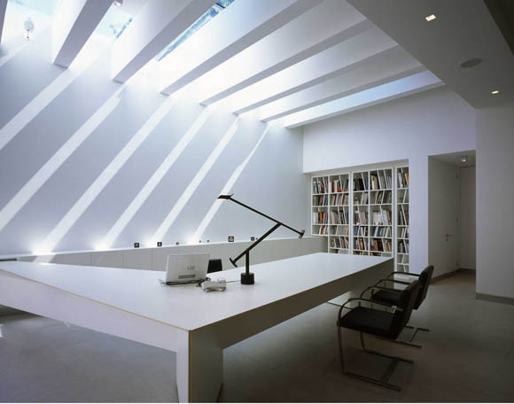
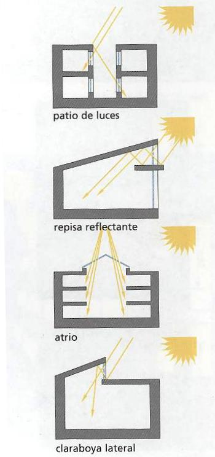
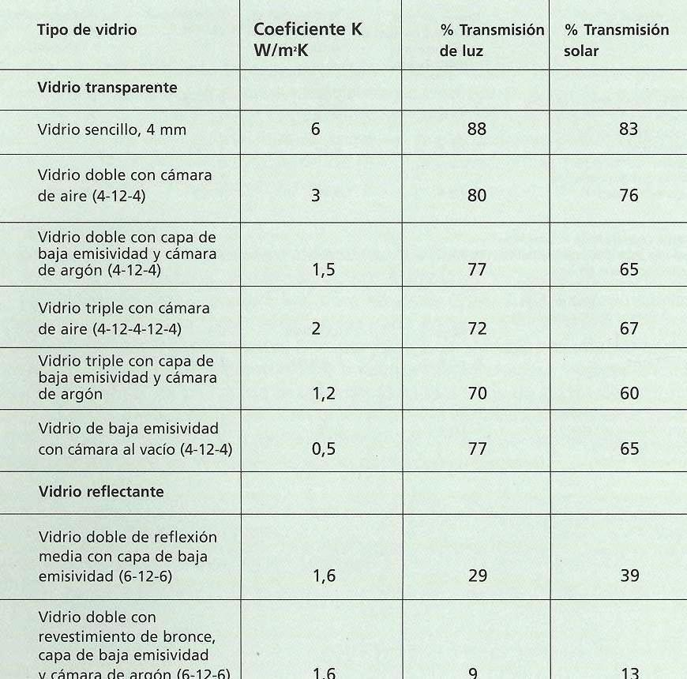
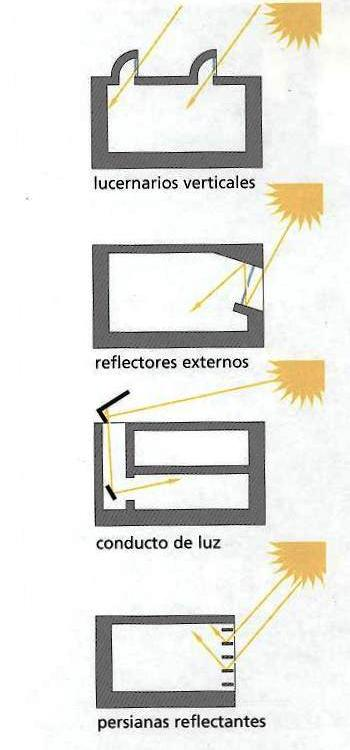

 Iluminación y ventanas.   INSTITUTO TECNOLÓGICO Y DE ESTUDIOS SUPERIORES DE MONTERREY ESCUELA DE ARQUITECTURA, ARTE Y DISEÑO DEPARTAMENTO DE ARQUITECTURA Diseño Bioclim&aacutetico Arq. Edmundo José Reyes Guzmán. Nombre:_______________________________ Fecha:________________________________ Grupo:________________________________ ILUMINACIÓN "La luz es la primera de las condiciones variables que influyen en la arquitectura. La luz es una de las condiciones que rodean a la arquitectura, pero también puede ser utilizada como elemento. La luz solar es el medio dominante a través del cual la gente experimenta la arquitectura; pero la luz, tanto natural como artificial, puede ser manipulada por el diseño para identificar lugares concretos y darles un carácter específico."La iluminación artificial es responsable de un 50% del consumo de energía en los edificios de oficinas, y de una parte considerable de la energía en otros edificios no residenciales.En la actualidad, el uso de la luz natural combinada con sistemas de iluminación de alta eficiencia permite ahorrar fácilmente un 30-50% y, en algunos casos, es posible alcanzar niveles de ahorro del 60-70%.Por tanto, reemplazar la luz artificial por la la luz natural conllevará un considerable ahorro de energía. Los espacios que reciben luz natural son más atractivos y más económicos para vivir y trabajar. Además, la carencia de luz en nuestro entorno puede producir problemas de salud, como el trastorno afectivo estacional (TAE) y la falta de vitamina D. Los requisitos de la luz natural dependerán de la función del edificio, sus horas de uso, el tipo de usuario y las necesidades de vistas, intimidad y ventilación, así como de los objetivos energéticos y medioambientales, donde un buen diseño de las ventanas de un edificio dependerán de la: Posición, forma y tamaño de los huecos. Características de los materiales de acristalamiento. Posición, forma y dimensiones de los dispositivos de sombreado. Actualmente existen varios mecanismos para captar la luz natural y dirigirla al interior de los edificios, así como para reducir niveles excesivos de claridad cerca de las ventanas y proporcionar una distribución más homogénea de la luz natural.Algunos de éstos mecanismos -patios, repisas reflectantes, domos lucernarios y ventanas altas- pueden tener importantes consecuencias en el proyecto; otros, como el vidrio prismático, las persianas reflectantes o los dispositivos para proporcionar sombra pueden aplicarse más fácilmente a los edificios ya existentes. VENTANAS. El nivel de iluminación natural en el punto determinado de un espacio depende mucho de la cantidad de cielo visible por la ventana desde ese punto. En consecuencia, la instalación de zonas acristaladas cerca del techo es positiva de la luz natural. Por ejemplo, las ventanas altas y estrechas proporcionan una mejor distribución de la luz natural en el espacio que las ventanas bajas y anchas. En el caso de las ventanas en esquina o en la planta superior, la disposición de las ventanas en más de una fachada o tragaluces también mejorará la distribución de luz natural.Es posible dividir las ventanas para satisfacer distintas demandas; se podría colocar una parte más baja para garantizar las vistas y otra más alta para permitir la entrada de luz, y estas incluso podrían estar sombreadas de distinta forma. Incluso hay ventanas para iluminar y otras para ventilar. Dependiendo de las estrategias pasivas implementadas.Un ejemplo. La repisa reflectante. La repisa reflectante proporciona sombra a la mayor parte de la ventana, pero refleja la luz hacia el techo y permite que penetre hasta el fondo del espacio. AISLAMIENTO TÉRMICO El vidrio es un mal aislante término. Existen varias formas de reducir la pérdida de calor a través del acristalamento: a)El vidrio doble (dos hojas de vidrio con una cámara de aire intermedia) es el tipo de acristalamiento eficiente especificado con mayor frecuencia. b)El revestimiento del vidrio con una capa de baja emisividad reduce la pérdida de calor por radiación, resulta caro, pero su especificación podrá justificarse simplemente por motivos de confort. c)Algunos gases como el argón y el criptón, pueden utilizarse en la cámara en lugar del aire para reducir aún más la pérdida de calor por convección.           A continuación se pide, Responde ampliamente a las siguientes preguntas: a) ¿Cuánto es el % del consumo de energía que ocupa la luz artificial en los edificios de oficinas?...b) ¿En que consiste el Transtorno Afectivo Estacional (TAE)?...c) Realiza algunos bocetos en sección de patios, repisas reflectantes, domos lucernarios y ventanas altas utilizados como mecanismos para captar y dirigir la la luz.d) ¿Porque son más importantes las ventanas altas y estrechas que las bajas y anchas.e) Busca en internet alguna marca y/o fabrica que entre sus productos tenga vidrios de dos hojas de vidrio con cámara de aire, en donde en medio del mismo contenga algún gas. f) El coeficiente K w/mk es el calor que pasa a través de la ventana. Según la lista de la presente acitividad.. ¿Cuál virdio transmite más y menos calor y porque?...f) Menciona algún Centro Comercial techado de Monterrey que contenga lucernarios verticales, ¿Hacia dónde están orientados?.. ¿Poseen alguna capa de protección solar con película de polarizado adherente?...   Posición y tamaño de las ventanas. X   En el diseño de superficies acristaladas es necesario tomar en cuenta: a) Tamaño y orientación de las ventanas. b) Tipo de acristlamiento. c) Tipo de carpintería y detalle de las juntas para evitar la infiltración. d) Medidas de control solar. e) Medidas de aislamiento nocturno. f) Ventanas practicables. (Que se abran!). 

