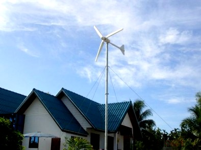
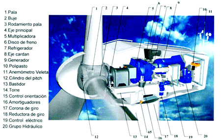
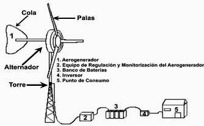

 Aerogenerador eólico casero.   INSTITUTO TECNOL&OacuteGICO Y DE ESTUDIOS SUPERIORES DE MONTERREY ESCUELA DE ARQUITECTURA, ARTE Y DISE&NtildeO DEPARTAMENTO DE ARQUITECTURA Diseño Bioclim&aacutetico Nombre:_______________________________ Fecha:________________________________ Grupo:________________________________ Aerogenerador casero.Un aerogenerador es un generador eléctrico movido por una turbina accionada por el viento (turbina eólica). Sus precedentes directos son los molinos de viento que se empleaban para la molienda y obtención de harina. En este caso, la energía eólica, en realidad la energía cinética del aire en movimiento, proporciona energía mecánica a un rotor hélice que, a través de un sistema de transmisión mecánico , hace girar el rotor de un generador, normalmente un alternador trifásico, que convierte la energía mecánica rotacional en energía eléctrica.A diferencia de los aerogeneradores gigantes de los grandes parques o centrales eólicas, los pequeños aerogeneradores caseros son utilizados para suministrar energía eléctrica a edificios e instalaciones que no están conectados a la red eléctrica. Cada vez es más habitual ver pequeños aerogeneradores caseros en zonas rurales, en escuelas, supermercados, granjas e incluso viviendas particulares. Un aerogenerador casero de 2 metros de altura colocado en el techo de la casa, es suficiente para aprovechar el viento y generar electricidad. La potencia de estos pequeños aerogeneradores oscila entre los 1,5 kw y los 5 kw. Entre sus ventajas podemos destacar su fácil instalación y su bajo costo de mantenimiento. Los aerogeneradores caseros que podemos encontrar en el mercado son pequeñas turbinas eólicas con una potencia de entre 1 kW y 36 kW. Cálculos Teóricos.La Potencia Eólica es la potencia en Watios que puede proporcionar el viento, y que podemos calcular utilizando la siguiente expresión matemática: Pe = 1/2 * rho * Area * Vv^3 Donde: Pe = Potencia Eólica en Watios. rho = Densidad del Aire en Kg/m3. Área = Superficie frontal del aerogenerador en m2. Vv = Velocidad del Viento en m/s. Componentes de un aerogenerador. Materiales de las palas de un aerogenerador.               Componentes de un aerogenerador.   Torre. Soporta la góndola que es donde se encuentran la mayoría de componentes principales del aerogenerador. La torre permite que las palas estén a la altura mas apropiada para obtener el máximo rendimiento posible. Las palas del rotor. Componente del aerogenerador que transmite la energía cinética del viento al buje. En su mayoría los aerogeneradores tienen tres palas. Buje del rotor. Une las palas al eje del aerogenerador. El buje es el componente del rotor que une las palas con el sistema de rotación y constituye el centro del rotor, al cual se fijan los álabes. El buje se fabrica de hierro o acero fundidos.El buje transmite la energía desde el rotor hasta el generador. Si la turbina eólica posee caja multiplicadora, el buje se conecta al árbol de baja velocidad de la caja multiplicadora, convirtiendo la energía del viento en energía rotacional. Si la turbina es de conexión directa, el buje transmite la energía directamente al generador. Eje de baja velocidad. En los grandes aerogeneradores el rotor gira muy lento entre 20 y 50 rpm. Caja de engranajes o multiplicador. Componente del aerogenerador que transforma la baja velocidad del eje en alta velocidad de rotación. Generador. Uno de los componentes principales. Gracias a la alta velocidad de rotación del eje se genera la electricidad. Sistema de control. Componentes que controlan el correcto funcionamiento del aerogenerador. Anemómetros, veletas, mecanismos de orientación, unidades de refrigeración, sistemas de control de potencia, etc.En resumen, el rotor es todo el conjunto de elementos de la turbina eólica que gira por delante y fuera de la góndola. El más adecuado para producir energía eléctrica es el rotor tipo hélice. El rotor convierte la energía del viento en rotación y, por lo tanto, es el motor. Álabes Conocidos también como aspas o palas, los álabes son una parte imprescindible y fundamental en una turbina eólica. Realizan varias tareas y deben resistir grandes cargasLos álabes toman la energía del viento, la capturan y la convierten en rotación en el buje. El perfil aerodinámico de los álabes es similar al perfil del ala de un avión. Los álabes emplean el mismo principio de la fuerza de empuje que actúa por la parte de abajo del ala. El aire produce una sobrepresión en la parte inferior y un vacio en la parte superior. Esta provoca una fuerza de empuje que hace que el rotor rote. MaterialesUno de los aspectos más importantes en la exitosa fabricación de los álabes es la elección del material a emplear para su producción. Su vida útil depende, en gran medida, del material de que está fabricado. Materiales de las palas de un aerogenerador   Tradicionalmente, los materiales utilizados en la fabricación de palas han sido la madera, el acero, el aluminio y en los últimos años los materiales compuestos: poliéster o resina epóxica reforzado con fibra de vidrio o fibra de carbón. La madera sola o su combinación con resina epóxica es cada vez menos usada en la fabricación de aspas. Los álabes de aluminio y las aleaciones de acero son pesados y vulnerables a la fatiga. Estos materiales son, por lo tanto, generalmente solo usados en turbinas muy pequeñas. Los álabes deben ser de bajo peso y tener un comportamiento mecánico adecuado durante su vida útil y los materiales compuestos son los que cumplen todos estos requisitos, por eso se han impuesto. Regulación de potenciaEl sistema de regulación de potencia se encuentra insertado en el rotor y en particular en sus álabes. La potencia que una turbina eólica absorbe tiene que ser controlada. Si el viento es muy fuerte, la potencia es reducida para prevenir daños al sistema. Esta regulación se realiza en el rotor. Básicamente,existen dos principios de regulación de potencia: Regulación por pérdida aerodinámica pasiva; es decir, Cuando el viento alcanza la velocidad máxima de diseño, la automática del aerogenerador procederá a frenar la turbina, haciendo rotar por un mecanismo especial los extremos de las palas, conocido por freno aerodinámica, y provoca un fuerte frenado aerodinámico. La segunda es regulación por cambio de paso del álabe (pala), donde Un sistema de control monitorea la potencia que entrega la turbina. Si el viento es demasiado fuerte, los álabes se hacen girar contrario a la dirección del viento, generalmente algunas fracciones de grado. Esto reduce la sustentación o empuje, de forma que el rotor continúa generando su potencia nominal aunque las velocidades del viento aumenten. PREGUNTAS: 1.- ¿Cuál es la gran diferencia entre un aerogenerador gigante y uno pequeño?... 2.- ¿Cuál es la potencia de un aerogenerador de 2 metros de altura?.. 3.- Menciona los principales componentes de un aerogenerador.4.- Explica la función del buje del motor en un aerogenerador.5.- Menciona los materiales de las palas de un aerogenerador. 6.- ¿Qué es lo que sucede cuando el viento sopla con mucha velocidad con las palas de un aerogenerador?... 7.- En la Figura B. Tenemos las partes de un aerogenerador eólico gigante... ¿Cuál crees tu que sea la función del Cilindro de pitch?... 8.- En la Figura D. Tenemos las partes de un aerogenerados eólico doméstico... ¿Cuál es la función del inversor?..     

