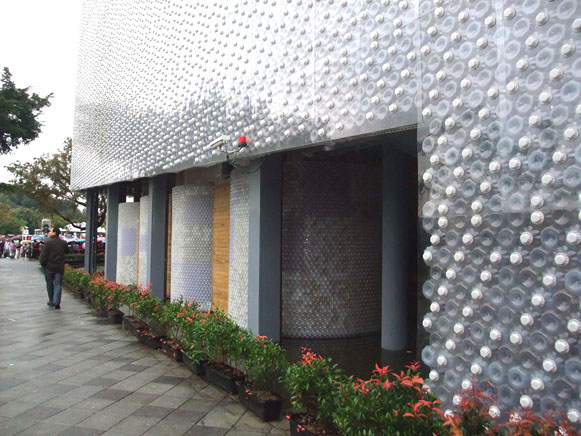
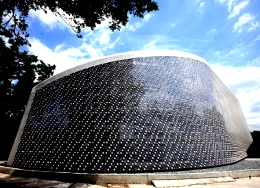
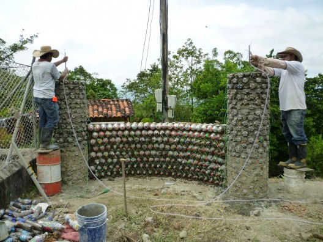
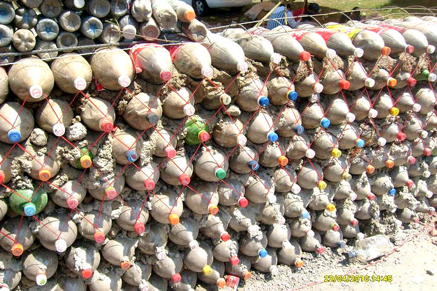
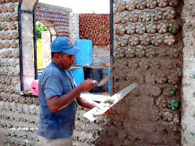
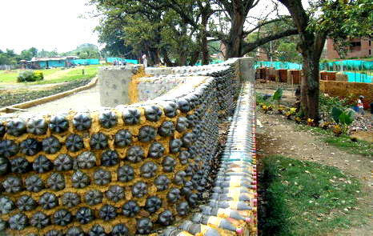
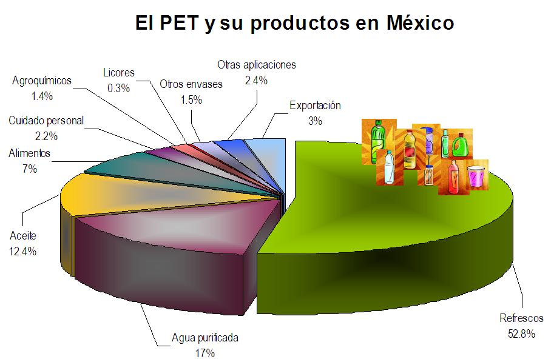
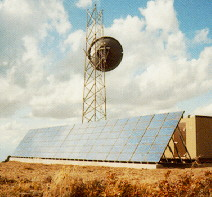

Construir con Politileno Tereftalato

 
 

INSTITUTO TECNOL&OacuteGICO Y DE ESTUDIOS SUPERIORES DE MONTERREY 
ESCUELA DE ARQUITECTURA, ARTE Y DISE&NtildeO 
DEPARTAMENTO DE ARQUITECTURA

Diseño Bioclim&aacutetico/ Sustentabilidad Ambiental
Nombre:_______________________________ 
Fecha:________________________________ 
Grupo:________________________________ 

El Pet como material constructivo.   

 El PET se empezó a genealizar su estudio a partir de la década de los años 80, en envases descartables en sustitución de los envases de vidrio retornables, uno de los motivos por los cuales aumentó el volúmen de la basura urbana considerablemente. 

 Con el uso del PET en las construcciones se obtienen: 
 Ladrillos para muros. 
 Bloques para muros.
 Placas para muros.

 Colocación: 

 Para la construcción de muros con botellas de plástico, debemos colocarlas a lo ancho (es decir, horizontalmente)... y alternarlos para que queden uniformes, osea que al observar una hilera, la base de una botella alterne con la tapa de otra botella.
 Es importatante que se use siempre el mismo tipo y tamaño de botella. 
 Se deben de pegar las botellas de la misma manera que se colocan los adobes de barro y ladrillo. 
 A continuación se analizará el reciclaje del PET desde 2 puntos de vista: 
El Pet como material constructivo. 
El PET como problema amibiental y oportunidad de reciclaje.
 Para una edificación de 15 metros cuadrados y de dos espacios, se necesitan 2400 botellas de plástico de medio litro. 
 Las botellas plásticas se usan en utilizan en vez del block. 
 El método de construcción consiste en: 
 Forrar las estructuras de madera con alambre de gallinero. (La madera se cura con aceite quiemado y pentanol, para que no se pudra). En el espacio interior de la malla se ordenan las botellas y se recubre con cemento. 

 VENTAJAS: 
 Se evita el aumento del volumen de basura, ya que con el reciclado se reduce la cantidad de desechos.
 Reduce también la cantidad de predios de enterramiento sanitarios municipales. 
 
 Nueva fuente de empleo; tano para pepenadores como para en mano de obre interesada en la elaboración de elementos constructivos y su posterior montaje.
 

 En la actualidad el PET se utiliza principalmente en tres líneas de producción:
 
1. PET textil: utilizado para fabricar fibras sintéticas, principalmente poliéster. Se emplea para fabricar fibras de confección y para relleno de edredones o almohadas, además de usarse en tejidos industriales para fabricar otros productos como cauchos y lonas.
 2. PET botella: utilizado para fabricar botellas por su gran resistencia a agentes químicos, gran transparencia, ligereza y menores costos de fabricación.
 3. PET film: utilizado en gran cantidad para la fabricación de películas fotográficas, de rayos X y de audio.
 El consumo global del PET se calcula en 12 millones de toneladas con un crecimiento anual de 6%. “El problema ambiental del PET radica en que tan sólo 20% del PET que se consume en el mundo se recicla, el resto se dispone en rellenos sanitarios y tiraderos a cielo abierto”.
 

 
 En México Se sabe que cada año se producen alrededor de 9 mil millones de botellas de PET, que representan casi una tercera parte de la basura doméstica generada en México. Anualmente 90 millones de botellas de refrescos y agua purificada son lanzadas a las vías públicas, bosques y playas. 
 Una botella de PET tarda hasta 500 años en degradarse.

  
 

 
 

  
 

  

  

 

 
 
El PET como problema amibiental y oportunidad de reciclaje.  
 En México, el principal uso de los envases de PET lo llevan las botellas de refresco, con más del 50%, seguido del agua embotellada (17%). 

Se sabe que cada año se producen alrededor de 9 mil millones de botellas de PET, que representan casi una tercera parte de la basura doméstica generada en México. Anualmente 90 millones de botellas de refrescos y agua purificada son lanzadas a las vías públicas, bosques y playas. Una botella de PET tarda hasta 500 años en degradarse. 

 
EcoArk. El edifico más grande construído con PET en el munndo. 
Arq. Arthur Huang de Far Eastern Group. Taipei,Taiwan. 
Es un modelo de edificio de impacto urbano que utiliza botellas de plástico pet como si fueran ladrillos para levantar sus envolventes.
Se llama EcoArk, y actualmente es la construcción que implementa botellas recicladas, más grande del mundo. En él se utilizaron 1,5 millones de envases de plástico, cubriendo un ancho total de 130 mts. y una altura de 26 mts. 
Este centro de convenciones, alzado por el grupo taiwanés Far Eastern Group, costó un total de 3 millones de dólares y fue donado al ayuntamiento de Taipei (capital de Taiwan).
El principal objetivo de esta gran obra de arquitectura ecológica, es mostrar a los habitantes del lugar los principales puntos del desarrollo sostenible: reducir, reutilizar y reciclar.
El pabellón se organiza en tres plantas de altura y cuenta con un anfiteatro y un salón de exposiciones.
Una cascada en la que se aprovecha el agua de lluvia, sirve para alimentar el sistema de aire acondicionado, además de ser un atractivo natural del lugar. 

PREGUNTAS: 
1.- ¿Cuál sería una posible colocación del PET según la presente actividad?... 
2.- Explica... ¿Cuáles son las 3 líneas posibles de producción de las botellas de plástico PET?... 
3.- ¿Cuantos millones de botellas PET se producen en México cada año?... 
4.- ¿Cuántos años tarda una botella PET en degradarse?.. 
5.- ¿Cuál es el porcentaje de producción de los refrescos fabricados con PET en México?...
6.- Explica ¿Cual es la función principal del edificio de Arthur Huang en Taipei, Taiwan?..
7.- Actualmente existen algunas empresas que fabrican el PET triturado y/o molido. Investiga y describe alguna empresa que se dedique a la construcción de los mismos.
8.- Existen además algunas máquinas trituradoras de PET en el mercado y en la we. Trituradoras de PET. 
 

 

 

¿Sabías que...

X

 

Las botellas de PET llegaron a México a mediados de la década de 1980 con gran aceptación entre los consumidores.
 En la actualidad, nuestro país es el principal consumidor de bebidas embotelladas. 
 Se estima que en México se consumen alrededor de 800 mil toneladas de PET al año, con un crecimiento anual de 13%. 
puedes enviar tus aportaciones consulta el Buzón de Sugerencias 

 ¿Deseas mandar un e-mail?...

