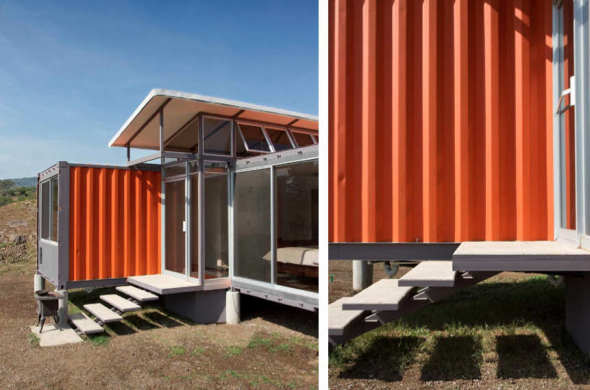
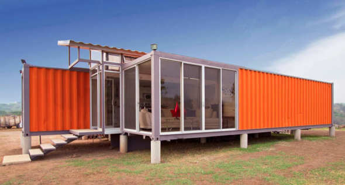
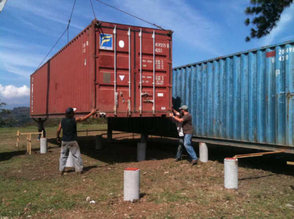
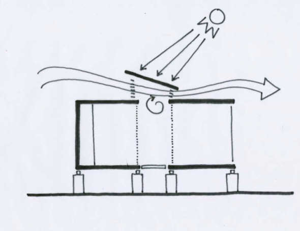
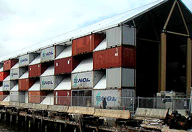

 Construcción con Containers   INSTITUTO TECNOL&OacuteGICO Y DE ESTUDIOS SUPERIORES DE MONTERREY ESCUELA DE ARQUITECTURA, ARTE Y DISE&NtildeO DEPARTAMENTO DE ARQUITECTURA Diseño Bioclim&aacutetico/ Sustentabilidad Ambiental Nombre:_______________________________ Fecha:________________________________ Grupo:________________________________ Un container tiene una vida de 10 años antes de ser desechados. Se utilizan en transporte de mercancías tanto vía terrestre marítima. Sus dimensiones estan normalizadas internacionalmente pero básicamente existen 2 tipos: a) 2.5m. x 6m. b) 2.5m. x 12m. Su construcción es sencilla: Propuesta económica y sostenible. Consiste principalmente en armar los cimientos en los que estará apoyado el contenedor y luego revestir las pareder con placas de yeso o otras capas de aislamiento. Es necesario además reforzar el acero para permitir que las estructuras se puedan colocar una sobre otra, o al menos que se coloquen en forma lineal. Al ser las cajas muy angostas los expertos unen 2 ó más según el diseño. VENTAJAS: Bajo precio. Se obtiene una vivienda en poco tiempo e incluso una vivienda emergente. Los containers soportan el peso de 6 o 7 piezas más colocadas una sobre otra. Nota: Para intentar mejorarlos y duren más los contenedores es necesario colocarles un antioxidante o bien una pintura especial que resguarde el exterior metálico ante los efectos del clima. a)  b)  c)  d)    En Costa Rica, el arq. Benjamín GArcía Saxe ha trabajado con contenedores generalemnte los coloca sobre zancos de madera, como el proyecto: Contenedores de la Esperanza La parte de arriba (techo)de los contenedores, se desprendierón de las paredes del mismo para permitir la entrada de la luz por ventanales superiores alargados en los muros, permitiendo además la ventilación cruzada. PREGUNTAS: 1.- ¿Cuáles son las medidas internacionalmente conocidas de los containers?...2.- ¿Cuál sería un posible método para la colocación y el montaje de los containers?...3.- ¿Cuáles son las ventajas principales de una construcción en containers?...4.- Explica el proyecto Contenedores de Esperanza del arq. Benjamín García Saxe fabricado con containers en Costa Rica.5.- Explica el principio de ventilación aplicado en el proyecto. (Ver figura d).   Sabías que... X   Un excelente ejemplo de arquitectura en containers es la obra del arquitecto japonés Shigerú Ban llamada: Museo Nómada Bianimale ubicada en Nueva York, Nueva York, Estados UnidosEl Museo Nómada primero fue diseñado por Shigeru Ban y el ingeniero Buro Happold, se estrenó en Nueva York en 2005, y luego viajó a Santa Monica, California (2006), Tokio, Japón (2007), y finalmente a la Ciudad de México, México (2008). Originalmente hecha de 152 contenedores de transporte, el diseño arquitectónico evolucionó a medida que viajaba. Los contenedores y otros materiales reciclados se apilan 34 pies de alto con el visitante que entra a través de una pasarela central de madera con paredes de piedra sobre las que se suspenda la obra de arte por medio de cables. Una cortina de bolsas de té se cuelga 40 metros sobre esto. El uso de recipientes de almacenamiento sugiere la naturaleza itinerante de la exposición, con la última instalación en la Ciudad de México es la mayor estructura de bambú nunca construido. Diseñado por el arq.Simón Vélez, la estructura ocupa 55.218 pies cuadrados (5, 130 m aprox.). ¿Deseas mandar un e-mail?... 

