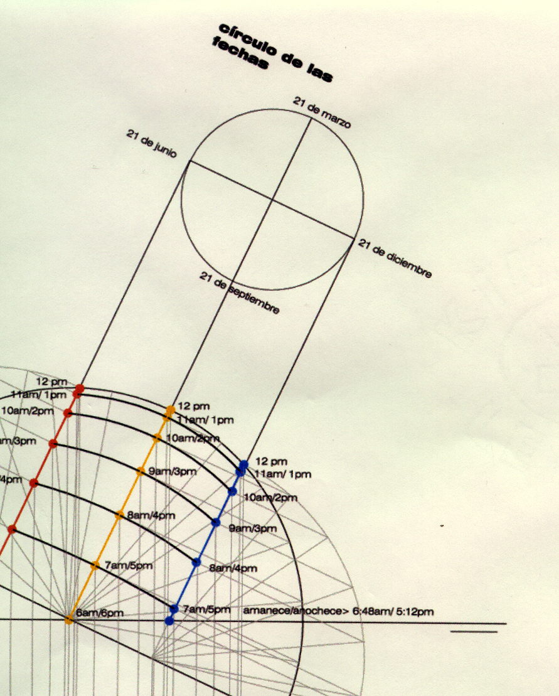
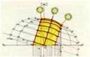

Soleamiento pasivo. Repentina sabatina.

 

 
INSTITUTO TECNOL&OacuteGICO Y DE ESTUDIOS SUPERIORES DE MONTERREY 
ESCUELA DE ARQUITECTURA, ARTE Y DISE&NtildeO 

DEPARTAMENTO DE ARQUITECTUA

Diseño Bioclim&aacutetico
Nombre:_______________________________ 
Fecha:________________________________ 
Grupo:________________________________ 
Hora de inicio:___________    Hora de salida:__________.

Objetivo de aprendizaje: 
El alumno elaborar&aacute las monteas esf&eacutericas y estereogr&aacuteficas para conocer el soleamiento e incidencia del sol en un problema espec&iacutefico dada una latitud X. 
 INSTRUCCIONES: 
Efect&uacutea las 4 sombras de las figuras pertinentes conforme la &uacuteltima cifra de tu matr&iacutecula y realiza las sombras proponiendo los $aacutengulos de incidencia solar de los voladizos convenientes seg&uacuten la orientaci&oacuten N,E,S y 0. 
Se entregar&aacuten: 
Montea Solar Esf&eacuterica. Elaboraci&oacuten de SV, SI y E. 

N&uacutemeros:

Figura A

Figura B

1

21 de diciembre 14:00 horas y 21 de junio 8:00 horas.

21 de junio 8:00 y 14 de abril 15:00 horas.

2 

 21 de diciembre a las 8:00 horas y 21 de junio 10:00 horas.

 14 de noviembre 15 horas y 8 de octubre 18 horas. 

3

 21 de junio a las 16:00 horas y 21 de diciembrre a las 7:00 horas.

 21 de diciembre a las 16:00 horas y 7 de marzo 15:00 horas.

4

16 de agosto a las 10:00 am y 21 de marzo a las 17:00 horas.

21 de junio a las 13:00 horas y 21 de diciembre a las 18:00 horas.

5

17 de marzo a las 9:00 horas y 21 de diciembre 17:00 horas.

21 de diciembre 14:00 horas y 21 de marzo 17:00 horas.

6

21 de junio a las 13:00 horas y 21 de diciembre a las 18:00 horas.

21 de diciembre a las 16:00 horas y 7 de marzo 15:00 horas

7

21 de diciembre a las 9:00 horas y 21 de marzo a las 17:00 horas.

12 de julio a las 17:00 horas y 9 de diciembre a las 7:00 horas.

8

21 de diciembre a las 16:00 horas y 7 de marzo 15:00 horas

14 de diciembre 14:00 horas y 21 de junio 8:00 horas.

9

21 de diciembre a las 16:00 horas y 7 de marzo 15:00 horas

21 de septiembre 14:00 horas y 21 de junio 8:00 horas.

10

7 de marzo 13:00 horas y 8 de octubre a las 14:00 horas.

31 de Enero a las 14:00 horas y 14 de mayo a las 8:00 horas.

 
 

 

  

 
 

 LEER ANTES DE EMPEZAR!...
No cambiar las fechas asignadas. Recuerda adem&aacutes: 
a) Planos a doble carta, utilizando tinta china y/o marcador, asoleamiento a color y con los "soles horarios" dibujados, marcados con n&uacutemero y a color. (Escribir la hora en cada recorrido).
b) Membrete, m&aacutergen, limpieza y calidad en la entrega. 
c) Las medidas y la escala proporcionadas, pueden ser cambiadas seg&aacuten sea el caso. Las sombras ser&aacuten achuradas. 
d) No pedir material ajeno. Pierdes tiempo y no habla bien de tu responsabilidad. 
e) El exam&eacuten es individual. Ev&iacutenme la pena de bajarle puntos o quitar el ex&aacutemen a los que sean "muy comunicativos/as".
f) NO PREGUNTAS!... 

4 SOMBRAS: 2 FIGURA A Y 2 FIGURA B en:
SV, SI y EO y EP. 
Escala: Sin Escala.

 

 

 Emergencias: 044 81 11 7 6666 0 

 LISTO/A?...

X

Es necesario asistir a la Repentina Sabatina con todo el material necesario: 
a) Papel calca y/o bond doble carta.
b) Escal&iacutemetro. 
c) Comp&aacutez. 
d) Transportador. 
e) Grapadora. 
f) Masking Tape. 
g) Colores: Prismacolor y/o Marcadores.
h) Tinta china y/o marcador negro.
i) Calculadora.
j) Plantilla de cículos.
i) Pistola de curvas. Curv&iacutegrafo.
j) Lapicero con sus respectivas puntillas.
k) Borrador de goma.
l) Borradorde tinta china.
m) Escuadras.
n) Regla "T".
o) Alcohol para limpiar el &aacuterea de trabajo.

 Suerte!.. 

