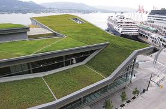
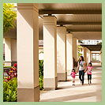
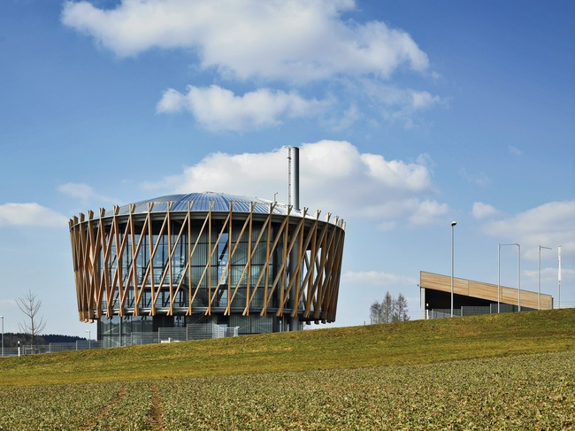
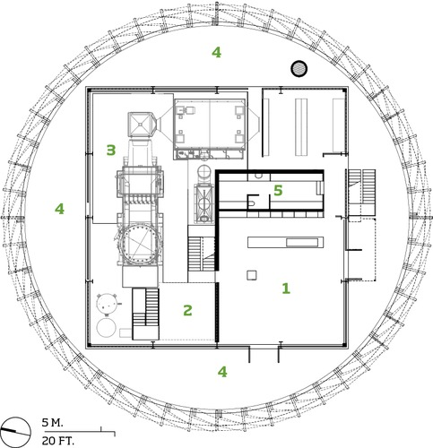
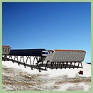
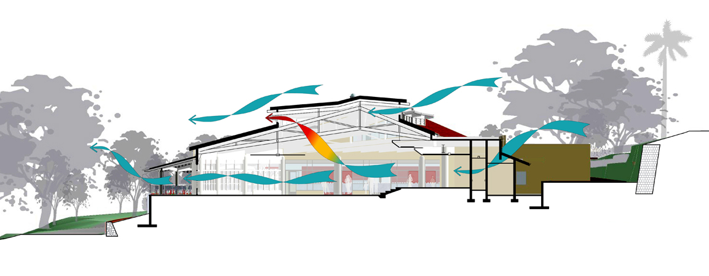

Case Studies.

 
 
INSTITUTO TECNOL&OacuteGICO Y DE ESTUDIOS SUPERIORES DE MONTERREY 
ESCUELA DE ARQUITECTURA, ARTE Y DISENO 

DEPARTAMENTO DE ARQUITECTURA

 Materias: &nbsp&nbspDise&ntildeo Bioclim&aacutetico ar2017 y Sostenibilidad Ambiental ar2002. 
Arq. Edmundo Jos&eacute Reyes Guzm&eacuten. 
Nombre:_______________________________ 
Fecha:________________________________ 
Grupo:________________________________ 

A continuación, se pide lo siguiente: 

De los casos de estudio favor de investigar lo siguiente: 
1.- Vancouver Convention Centre. 
Favor de realizar un resumen (puede ser en ingl&eacutes del presente artículo, para esto se te pide leer el PDF.
Article originally published in SABMag Jan/Feb, 2010 Issue 21 
SAB Magazine. 
2.- De la página Ferraro Choi's architectural design case studies:
Favor de seleccionar un caso de estudio y hacer un resumén: La página es: Nota: (Actualizada en 2012).
 Ferraro Choi Cases Studies.

3.- Green Source. Aesthetic Ecology: Biomass Power Plant 
Un caso de estudio de una planta de biomasa de alto impacto en el ára rural de el sureste de Alemania. Un modelo de diseño sustentable.
Responde a las siguientes preguntas:
1.- ¿Qué función tiene la máquina Organic Rankine Cycle?
2.- ¿Para qué se calienta el aceite de silicón?.. ¿Para producir qué?... 
3.- Explica la sección de la Biomass Power Plant
4.-¿Cómo utilizan la Biomasa en el edificio el estudio Matteo Thun & Partners?...
5.- Investiga en Internet de dónde proviene la energía de la Biomasa.

 

 

 
 

 
 

 

 Para conocer más.. visitar la página siguiente:

..

