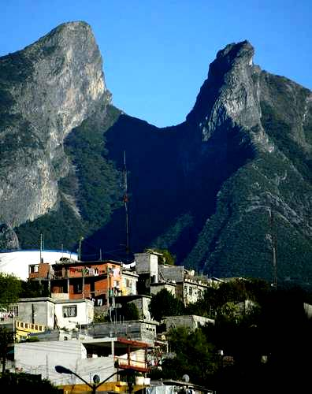
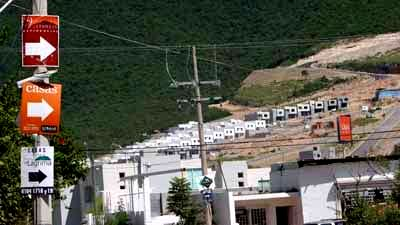
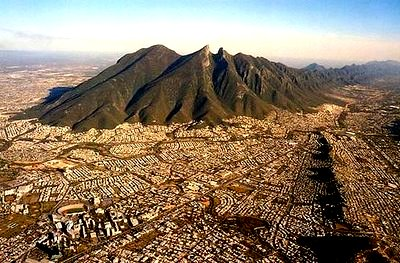
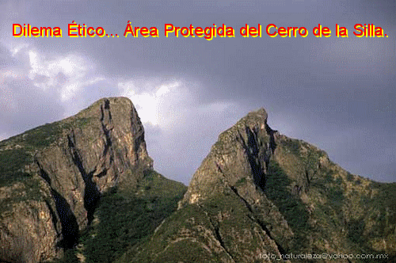
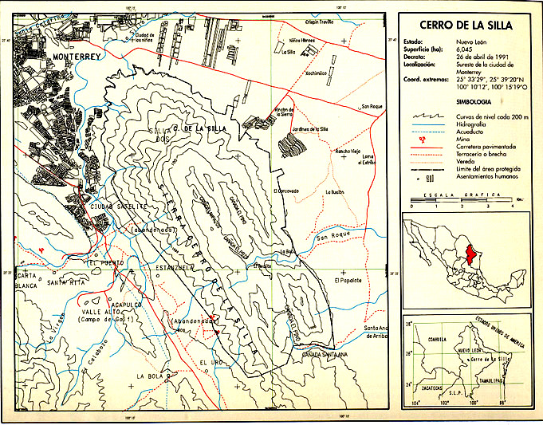

 Ejercicio de Dilema Ético.   INSTITUTO TECNOL&OacuteGICO Y DE ESTUDIOS SUPERIORES DE MONTERREY ESCUELA DE ARQUITECTURA, ARTE Y DISE&NtildeO DEPARTAMENTO DE ARQUITECTURA Diseño Bioclim&aacutetico Nombre:_______________________________ Fecha:________________________________ Grupo:________________________________ NOMBRE DEL DILEMA ÉTICO: Área Protegida del Cerro de La Silla.OBJETIVO: Generar en el alumno un cambio de postura a través de diferentes argumentos convincentes sobre un dilema ético, utilizando diferentes puntos de vista de pequeños grupos de trabajo. DISPOSICIÓN DEL AULA:Si el salón lo permite acomodar las sillas en forma circular. Si el grupo es muy pequeño, pueden mover las sillas para la parte de enfrente e improvisar una hilera en la parte frontal del salón. Metodología del caso en aula: (click!..) Área Natural Protegida. Caso: Cerro de la Silla. Existe interés en algunos sectores de la sociedad regiomontana por la protección de este monumento que identifica a la ciudad de Monterrey. Los residentes en el interior del área protegida están conscientes de la necesidad de proteger los recursos; sin embargo existen fuertes presiones de fraccionadores y habitantes irregulares por colonizar este sitio. La señora Tiziana Torres es una trabajadora de clase media, la cual está interesada en comprar casa propia bajo algún crédito hipotecario. Tiziana es una señora divorciada que ha decidido buscar un nuevo hogar y una nueva vida para sus 2 pequeños hijos, los cuales se encuentran aún bajo la patria potestad por parte de su exmarido. Desea una casa con espacios amplios, excelentes vistas, área de estacionamiento de visitas, cochera doble, un pequeño jardín, pero sobretodo que la residencia tenga una excelente ubicación. Después de haber estado indagando por toda la ciudad de Monterrey y visitar diferentes inmobiliarias. Tiziana ha encontrado posibles opciones residenciales a través de diferentes desarrolladoras pero no encuentra una sola que tenga áreas verdes para que sus hijos puedan jugar sanamente. Finalmente, se decide por una pequeña casa localizada en las faldas del Cerro de la Silla en la Colonia Villa Las Fuentes. El Desarrollador interesado en venderle la casa le comenta a ella: "Es usted muy afortunada en comprar ésta propiedad señora, ya que la fachada principal tiene una excelente vista hacia al área verde municipal la cual se encuentra absolutamente protegida por ser parte del famoso emblema regio". Por lo que Tiziana decide comprarla de inmediato, ya que desde su ventana puede ver el Cerro de la Silla. Después de un tiempo, la situación de la familia Torres empeora, su marido muere de un ataque al corazón, por lo que Tiziana se ve obligada a dejar su casa y rentarla para poder sobrevivir económicamente con sus 2 hijos. Logra después de 3 meses rentar la casa. Un día recibe una llamada de la rentera… la cual le comenta que están limpiando el terreno de enfrente, desmontándolo y marcando con cal para la inauguración de un nuevo fraccionamiento. Tiziana, se siente engañada por aquel desarrollador interesado solamente en la venta de la casa, por lo que decide ir a buscarlo. Al dirigirse a las oficinas de la inmobiliaria, aquel desarrollador ya no trabaja con ellos y nadie sabe sobre su paradero. Finalmente, la señora desesperada encuentra en Internet... que el Cerro de la Silla fue declarado: El 26 de abril de 1991 monumento natural por el presidente Carlos Salinas de Gortari pero no sabe si al área verde incluye su casa. Cree necesario dirigirse a las Oficinas de la Dirección de Catastro Municipal de la Ciudad de Monterrey para investigar la posibilidad de encontrar algún plano y/o documento puede encontrar información sobre el área verde perdida. Por otra parte, le comentan que debe dirigirse mejor a la Secretaria de Medio Ambiente y Recursos Naturales. (SEMARNAT)… o bien al Instituto Nacional de Ecología. Además una amiga de ella le informa sobre la existencia de un Patronato del Monumento Natural Cerro de La Silla, A.C. Tiziana está desesperada!.. y no sabe.. ¿Qué hacer?... PREGUNTAS: 1.- ¿Debe demandar la señora Torres a la inmobiliaria que le vendió la casa?...2.- ¿Qué debe de hacer la señora ante su actual situación?...3.- Expliquen si la señora.. ¿Debería haberse informado antes de comprar la casa?.. 4. ¿Dónde puede encontrar Tiziana la Declaración del Área Natural Protegida del Cerro de la Silla?... ¿Qué delegación gubernamental se encarga de éstos casos?...5.- ¿Dónde puede verificar si el área verde del Cerro de la Silla es también el área enfrente de su casa?. 4.- ¿Quién es finalmente "culpable" ?...               ¿Qué se analiza en una Dirección de Catastro?... Aclaración o cancelación de cambio de propietario efectuado con aviso de enajenación de notario Acreditación o rectificación de medidas Acreditación o rectificación de medidas Alta de predios sólo en Catastro Autorización y registro de condominios Avalúo catastral Aviso de enajenación Bajas de construcción Cambio de propietario Certificado de no propiedad o única propiedad Constancia certificada de información catastral Copia de plano de terreno Copias de plano de antecedentes Copia de antecedentes de expediente Fraccionamiento Relotificación Inconformidad valor catastral en primera y segunda instancia Informativo de valor catastral para trámite notarial Informativo de valor catastral para pago de derechos por trámite ante Desarrollo Urbano Informativo de valor catastral para rectificación de medidas Numeración Resello de planos de construcción Registro de construcción Subdivisión Fusión Desglose Ubicación o información de propiedad Modificación de domicilio FUENTE: http://www.nl.gob.mx     METODOLOGÍA del dilema ético en clase: 1.- El profesor entregará el Dilema Ético a los alumnos, los cuales tendrán 10 minutos para su lectura. 2.- El profesor lee en plenaria el caso ético. Al final del mismo, al llegar a la última pregunta: #4.- ¿Quién es culpable?... Dividirá el salón en 3 equipos y/o grupo de trabajo. 3.- Espacio de búsqueda de información en INTERNET. El profesor otorgo 20 minutos para que los alumnos se informen. 4.- Finalmente el profesor debe concluir: 1.- Los que votan por el desarrollador. 2.- los que votan por la señora. 3-. Los que votan por la corrupción municipal. 5.- Cada grupo de trabajo, deberá enunciar argumentos válidos en la cual los alumnos defiendan sus respectivas posturas. Seleccionarán además un Coordinador Representante, el cual tendrá posteriormente que informar los argumentos cuando el profesor lo solicite. Nota: Pueden utilizar el internet para verificar sobre áreas verdes protegidas y/o reglamentación actual. 6.- El profesor pregunta ante el grupo… ¿Cuál sería el argumento del equipo de trabajo más convincente que defiende mejor la postura del equipo en cuestión?... Nota: Cada equipo de trabajo seleccionará la mejor opción del equipo contrario y viceversa. Los alumnos discuten. 7.- El profesor pregunta en plenaria… ¿Existe alguno de ustedes que cambiaría su postura inicial por otra del equipo contrario?... Los alumnos discuten. 8.- Si el profesor obtiene un gran número de alumnos que cambian su postura inicial el caso ha tenido un éxito sorprendente. Recuerden!: La participación en clase es muy importante!....   ¿Sabías que... X   Un dilema ético es una narración breve, a modo de historia, en la que se plantea una situación posible en el ámbito de la realidad pero conflictiva a nivel moral, y se solicita de los oyentes o bien una solución razonada del conflicto, o un análisis de la solución elegida por el sujeto protagonista de la historia. ¿Deseas mandar un e-mail?... 

