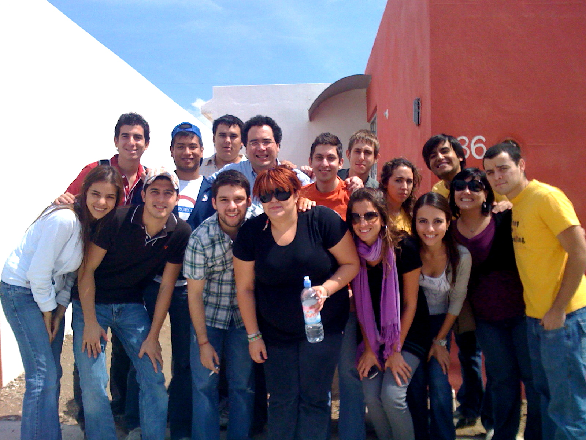
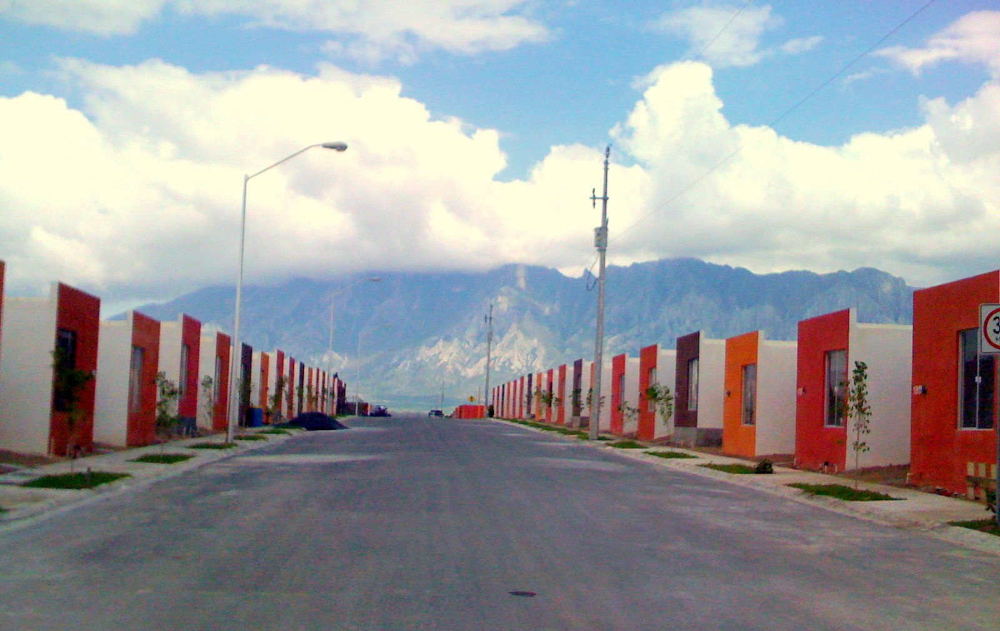
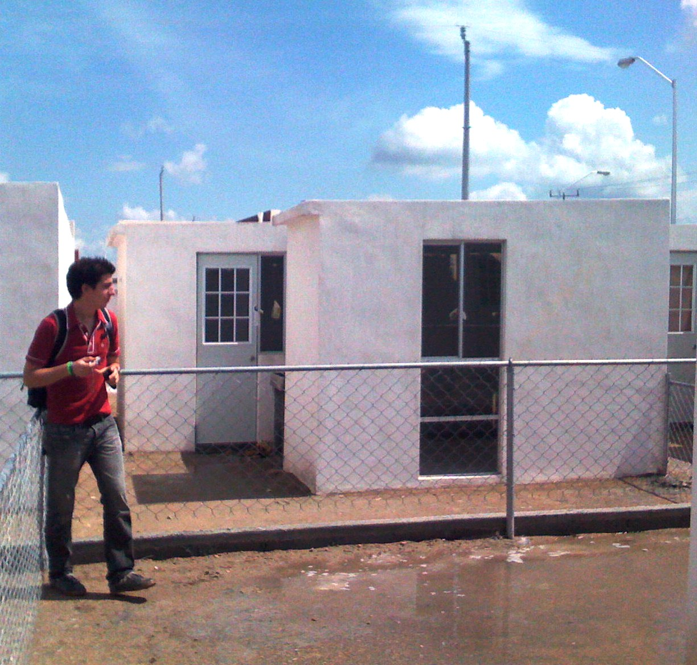

Recorrido en Sketchup

 
 

INSTITUTO TECNOL&OacuteGICO Y DE ESTUDIOS SUPERIORES DE MONTERREY 
ESCUELA DE ARQUITECTURA, ARTE Y DISE&NtildeO 

DEPARTAMENTO DE ARQUITECTUA.

Dise&ntildeo Bioclim&aacutetico
Nombre:_______________________________ 
Fecha:________________________________ 
Grupo:________________________________ 

Breve introducci&oacuten al concepto de VIS (Vivienda de Inter&eacutes Social): 
 Vivienda de inter&eacutes social: Es la casa habitaci&oacuten cuyo costo no rebasa los l&iacutemites fijados por el INFONAVIT y est&aacute ligado al valor del salario m&iacutenimo. 
 Se considera que cualquier casa habitaci&oacuten debe tener m&iacutenimo 3 rec&aacutemaras. El reto que ha tenido el pa&iacutes desde hace d&eacutecadas es c&oacutemo incrementar la oferta de VIS, oferta que responda a la demanda insatisfecha de esta vivienda, y hacerlo dentro de un marco institucional de legalidad para que no sea atendido por la urbanizaci&oacuten pirata e ilegal que ha caracterizado el desarrollo de nuestras ciudades.
 El reto es m&uacuteltiple: c&oacutemo construir viviendas de tamaño y condiciones dignas a un precio (con subsidio) que sea alcanzable; c&oacutemo construir estas viviendas en sitios que no disten mucho de los lugares de trabajo naturales en las ciudades, y c&oacutemo obtener la tierra para hacerlo, entre otros. 

Recorido virtual en Sketchup en una VIS. 
El software Sketchup, ofrece al alumno la posibilidad de hacer un recorrido exterior e interior de la vivienda. 
El procedimiento es el siguiente: Consultar primero en http://www.youtube.com/watch?v=ElTk_NDP1b8&feature=related Para ver el procedimiento "en espa&ntildeol".. o en ingl&eacutes". 
Baja (Download) el sotware en la liga siguiente: SKETCHUP
Es necesario que puedas practicar lo necesario en tu casa, para que logres dominar el software. 

INSTRUCCIONES: 
Con el comando "Add Scene/Crear Escena" agrega escenas como si fuera una pel&iacutecula, de tal manera que el reto es posicionar la c&aacutemarita "a escala humana", para que pueda sugerir que el observador estubiera caminando en el interior de la VIS. Es decir, el procedimiento sería: VENTANA/ESCENA/(Posicionando el mouse en la pr&oacutexima escena!..)/ CREAR ESCENA/ y Reproducir animaci&oacuten.
 Exportar el video en alta calidad en un CD. 
CONTENIDO DEL ENTREGABLE: 
Conforme el plano otorgado por el profesor, empieza realizando en Sketchup, el desplante y alturas de los muros. No olvides: Que es necesario que tu recorrido tenga tanto ambientaci&oacuten interior como exterior.
 Nota: En el pr&oacute ejercicio se tendr&aacute que utilizar el soleamiento horario pro lo que es necesario DOMINAR completamente el programa. 

Buen Trabajo.

Tu profe, 
Edmundo.

 

 

 

 

 
 

 

ES RECOMENDABLE!..

X

 

 
Es recomendable escuchar los tutoriales que vienen en la p&aacutegina princial del SKETCHUP para facilitar su entendimiento. 
Gracias.

