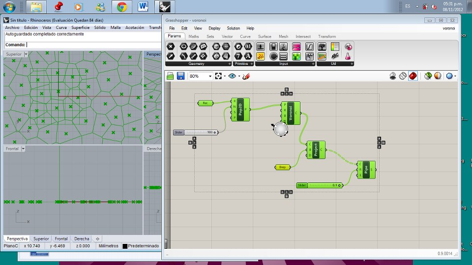
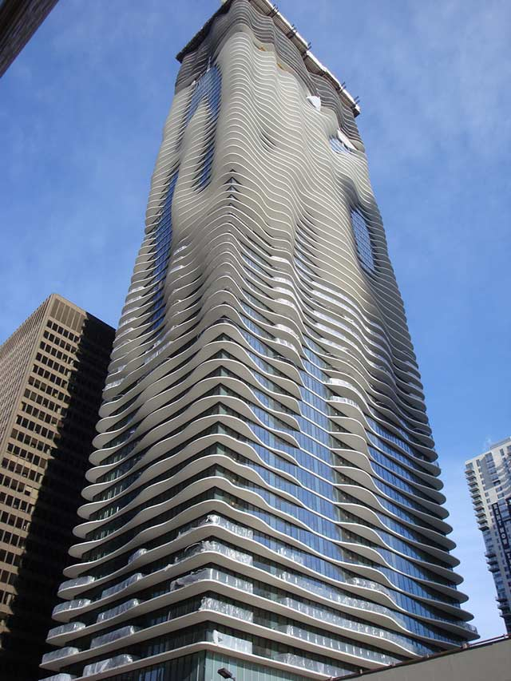

Grasshopper. Pérgola con curvas en Voronoi.

 

Instalación de Grasshopper 
1. Para empezar: 
 Para trabajar en Grasshopper es necesario tener 2 pantallas abiertas, una con Rhino 4 y otra con el Grasshopper. 
 
 Para descargar el plugin Grasshopper, visite http://grasshopper.rhino3d.com/. 
 Haz clic en el vínculo de descarga en la esquina superior izquierda de la página, y cuando se
 te solicite en la siguiente pantalla, introduce tu dirección de correo electrónico. 
 Ahora,
 haz clic derecho sobre el enlace de descarga y selecciona "Guardar destino" desde el
 menú.
 
 Selecciona una ubicación en tu disco duro (nota: el archivo no se puede cargar en
 más de una conexión de red, por lo que el archivo debe estar guardado localmente en el
 disco duro de la computadora) y guardar el archivo ejecutable en esa dirección. 

 
 Selecciona Ejecutar en el cuadro de diálogo de descarga, siga las instrucciones del
 instalador. (nota: debe tener SR4b con Rhino 4.0 o superior ya instalado en su computadora
 para instalar correctamente el plugin)
 
2. El diálogo principal 
 
 A. La barra de menú principal
 B. Control explorador de archivo
 
 Una vez que haya cargado el plugin, escriba Grasshopper en el comando de Rhino
 para mostrar la ventana principal de Grasshopper.
 
 El menú es similar a los típicos menús de Windows, excepto por el explorador de archivos
 en la derecha, B. 
 A través de este cuadro desplegable, se puede cambiar rápidamente
 entre diferentes archivos cargados, mediante su selección. Tenga cuidado al usar los
 atajos, ya que son manejados por la ventana activa. Ésta bien podría ser Rhino, el plugin
 Grasshopper o cualquier otra ventana dentro de Rhino.
 
 Dado que no se puede deshacer
 debe ser cauteloso con los atajos Ctrl-X, Ctrl-S y Del.
 
 Como se discutió en la sección anterior, este menú desplegable se puede utilizar para
 cambiar entre los diferentes archivos cargados.

Actividad: 

Es necesario hacer una Pérgola en Grasshopper. La forma del curveado es VORONOI... es necesario ver éste video para entender el manejo de los comandos.

El resultado sería éste: 

 

 
 

  
  

 
 

 

 Entrega tu proyecto de Grasshopper con un print-screen en una hoja imprimiendo ésta actividad solamente.
Es necesario que aparezca ESCRITO TU NOMBRE DENTRO Y/O A LADO DE LA PÉRGOLA YA QUE LA COPIA NO ESTÁ PERMITDA.

Éxito y utiliza éste software en tu futura vida!. 

Te anexo además un manual en español para su correcto entendimiento.

¿NO ENTIENDES NADA?...

X

 

Estimado alumno(a): El Grasshopper es un software con diseño paramétrico. 
Uno de los edificios que ha utilizado el software es el edificio ACQUA de 

Es necesario ver éste video para entender el ejercicio.

