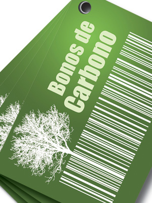
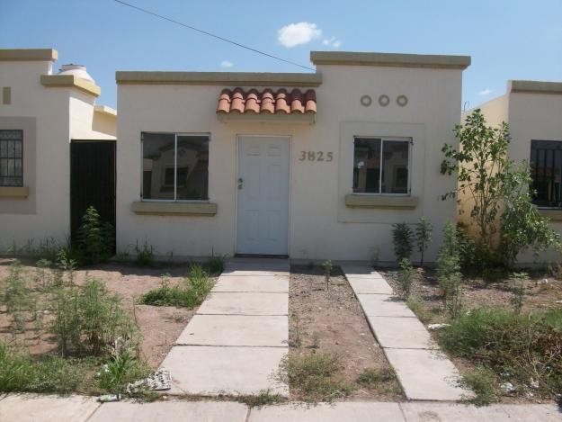
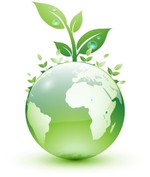
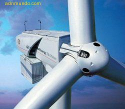
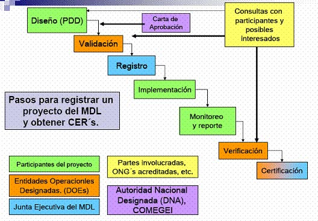

 Mecanismos de Desarrollo Limpio   El Mecanismo de Desarrollo Limpio es un procedimiento contemplado en el Protocolo de Kioto en donde países desarrollados pueden financiar proyectos de mitigación de emisiones de gases de efecto invernadero (GEI) dentro de países en desarrollo, y recibir a cambio Certificados de Reducción de Emisiones aplicables a cumplir con su compromiso de reducción propio (IPCC, 2001).A través del Mecanismo de Desarrollo Limpio (MDL) las empresas tienen la posibilidad de participar en el mercado de reducción de emisiones de gases de efecto de invernadero. Mientras que el Mecanismo de Desarrollo Limpio reduce el costo de cumplimiento de compromisos ente el Protocolo para países desarrollados, las economías en desarrollo se benefician del incremento en los flujos de capital de inversión para proyectos de mitigación y los resultados que estos ofrecen para las políticas de desarrollo sustentable. El Mecanismo de Desarrollo Limpio es regulado y supervisado por el Consejo Ejecutivo de MDL de la Convención Marco de las Naciones Unidas sobre el Cambio Climático. &nbsp         Desarrollo de proyectos MDL Las reglas establecidas por el Consejo Ejecutivo del MDL señalan las siguientes categorías como categorías autorizadas para el desarrollo de proyectos MDL:1. Industrias energéticas (renovables/no renovables) 2. Distribución de energía 3. Demanda de energía 4. Industrias manufactureras 5. Industrias químicas 6. Construcción 7. Transporte 8. Minas / producción mineral 9. Producción metalúrgica 10. Emisiones fugitivas de combustibles (sólidos, petróleo y gas natural) 11. Emisiones fugitivas de la producción y consumo de halocarbonos y hexafluoruro de azufre12. Uso de solventes 13. Disposición y manejo de desechos14. Forestación y reforestación 15. Agricultura Un proyecto MDL debe cumplir con las condiciones de adicionalidad, de determinación de la línea base y de contribución al desarrollo sostenible del país, según lo establece el Artículo 12 del Protocolo de Kioto.Un proyecto que participa en el MDL debe cumplir con el ciclo establecido de por el Consejo Directivo del MDL antes de poder recibir los beneficios económicos que resultan de esa participación. I. Diseño del proyecto. Este es el conjunto de actividades que culmina con el registro del proyecto MDL.. b1. Elaboración del Documento Diseño del Proyecto por el participante en el proyecto.Este documento contiene, de manera general, la siguiente información:a)Descripción general del proyecto b)Definición de la metodología usada para la Línea Base (baseline) del proyecto. Esta metodología debe tener la aprobación de el Consejo Ejecutivoc)Descripción de cómo se reducen las emisiones o se absorbe el carbono (demostración de la adicionalidad)d)Definición de la duración del proyecto y del período de acreditacióne)Análisis de los impactos ambientalesf)Referencia a las fuentes de públicas de financiamientog)Observaciones de los interesadosh)Plan y metodología de vigilancia de los resultados del proyecto y su justificación2. Validación del proyecto por la Entidad Operacional. Ésta es una evaluación independiente para comprobar, ante la Junta Ejecutiva del MDL, si el proyecto se ajusta a los requisitos del MDL. 3. Aceptación y registro del proyecto por la Autoridad Nacional Designada4. Aceptación y registro del proyecto por el Consejo Ejecutivo II. Ejecución del proyecto 1. Ejecución del plan de vigilancia por el promotor del proyecto 2. Verificación y certificación de las emisiones por la Entidad Operacional 3. Emisión por el administrador del registro MDL de las unidades de reducción resultantes del proyecto (RCEs), o absorciones de carbono. PREGUNTAS: 1. Si un país en vías de desarrollo quiere obtener un Certificado de Reducción de Emisiones (CRE)... ¿Qué es lo que tiene que hacer?...2.- ¿Cuál es el beneficio que obtienen los países desarrollados en financias proyecto de mitigación de gases de efecto invernadero (GEI)?.... 3.- Menciona los tipos y/o categorías de proyectos que pueden ser autorizados para implementar MDL?... 4.- Explica el Artículo 12 del Protocolo de Kyoto.5.- Explica los propósitos de MDL. 6.- ¿Quién regula y supervisa el MDL?...7.- ¿Quién regula un MDL?... 8.- ¿Cuáles son las categorías autorizadas para el desarrollo de proyectos MDL?.. 9.- Para registrar un proyecto MDL.. ¿Cuáles son los pasos que hay que seguir?... 10.- ¿Qué significa RCEs?...     

